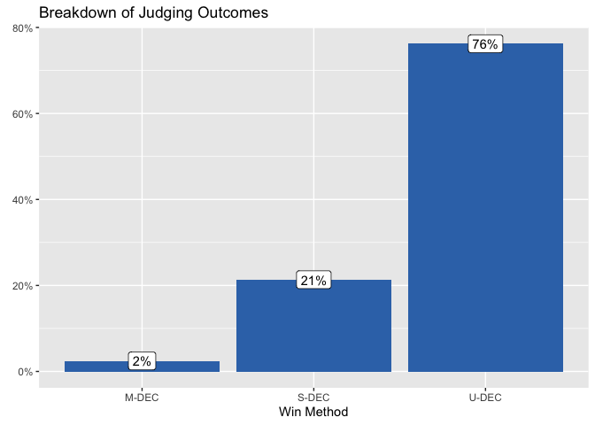
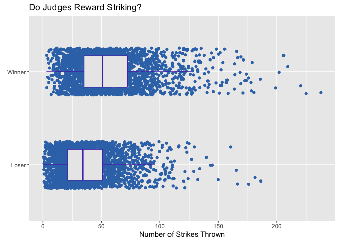

Is UFC Judging Fair?
================

When a UFC match ends with a knock-out or submission there is usually
never any doubt who the better fighter was. But only 53.68% of fights
end so decisvely. The other 45.03 of fights go to the judges score
cards.

<!-- -->

At least when the fights do go to the judges scorecard, it appears that
the judges are usually pretty confident. The judges are unanimous in
their decision76.21% of the time.

<!-- -->

But, judging is tricky business. It is frequenly the subject of public
scrutiny:

  - [The Bleacher Report’s 10 Most Controversial Judging Decisions in
    UFC History
    (2014)](https://bleacherreport.com/articles/2072171-the-10-most-controversial-judging-decisions-in-ufc-history#slide0)
  - [UFC commentator Joe Rogan on the issues with
    judging](https://www.youtube.com/watch?v=U8ZO5k5Gykk)

How can we assess if the judging if fair? Are the judges really
selecting the better fighter? Are they correctly applying the UFC rules
to select the winner?

### Assessing fairness

To answer this question we must first understand what the rules are. How
are the judges supposed to pick a winner? Then tools from statistics can
be used to see what the judges actually are looking at.

#### What are the rules?

The system is somewhat confusing, but here are the basics:

  - Judges score each round on a “*10-Point Must System*”.
      - The fighter deemed to have won the round receives 10 points.
      - The fighter deemed to have lost the round receives 9 points or
        fewer.
      - The figher with the most points at the end of the fight wins.
  - The [official MMA
    rules](http://www.abcboxing.com/wp-content/uploads/2016/08/juding_criteriascoring_rev0816.pdf)
    describe scoring as follows: \> - “*A 10 –10 round in MMA is when
    both fighters have competed for whatever duration of time in the
    round and there is no difference or advantage between either
    fighter.*” \> - “*A 10 –9 Round in MMA is when one combatant wins
    the round by a close margin.*” \> - "“*A 10 –8 Round in MMA is when
    one fighter wins the round by a large margin.*”

The official rules also provide additional guidance on what constitutes
winning. Some examples include: \> - “*Effective Striking/Grappling
shall be considered the first priority of round assessments. Effective
Aggressiveness is a ‘Plan B’ and should not be considered unless the
judge does not see ANY advantage in the Effective Striking/Grappling
realm. Cage/Ring Control (‘Plan C’) should only be needed when ALL other
criteria are 100% even for both competitors. This will be an extremely
rare occurrence.*” \> - “*Legal blows that have immediate or cumulative
impact with the potential to contribute towards the end of the match
with the IMMEDIATE weighing in more heavily than the cumulative
impact.*”

#### What are the judges scoring?

We can never know what was really going on in a judges head. But by
using the data from every UFC fight, we can identify which features are
strongly correlated with winning or losing.

Logistic regression will be used to model the data. Logistic regression
will assign a weight to each feature, with larger weights signalling
greater importance. My hypothesis is that if the judging is fair, the
weights assigned by logistic regression should be aligned with what the
judges are supposed to score.

For example, based on my reading of the rules *effective striking*
should be very important criteria for a judge in selecting the winner.
Although there is no perfect way to report effective striking as a
single number, the number of strikes thrown is probably a close proxy.

The data collected has several features including:

  - `str` - The number of strikes landed
  - `td` - The number of take-downs
  - `sub` - The number of submissions
  - `pass` - The number of passes

| fighter\_1\_name   | fighter\_2\_name | fighter\_1\_str | fighter\_2\_str | fighter\_1\_td | fighter\_2\_td | fighter\_1\_sub | fighter\_2\_sub | fighter\_1\_pass | fighter\_2\_pass | winner     |
| :----------------- | :--------------- | --------------: | --------------: | -------------: | -------------: | --------------: | --------------: | ---------------: | ---------------: | :--------- |
| Charles Oliveira   | Kevin Lee        |              43 |              41 |              0 |              2 |               2 |               0 |                0 |                2 | fighter\_1 |
| Gilbert Burns      | Demian Maia      |              13 |               4 |              0 |              2 |               0 |               0 |                0 |                1 | fighter\_1 |
| Renato Moicano     | Damir Hadzovic   |               1 |               1 |              1 |              0 |               1 |               0 |                1 |                0 | fighter\_1 |
| Nikita Krylov      | Johnny Walker    |              45 |              37 |              3 |              0 |               0 |               0 |                4 |                2 | fighter\_1 |
| Francisco Trinaldo | John Makdessi    |              55 |              67 |              0 |              0 |               0 |               0 |                0 |                0 | fighter\_1 |
| Brandon Moreno     | Jussier Formiga  |              33 |              15 |              0 |              1 |               0 |               1 |                1 |                3 | fighter\_1 |

Example of UFC data

If the model is to work, we would expect to see that more strikes,
take-downs, submissions, and passes is correlated with winning. For each
feature, we can plot the relationship to visually compare.

<!-- -->

<!-- -->

<!-- -->

<!-- -->

For striking, take-downs, and passes it appears that at least visually
the better performing fighter usually wins. The relationship between
submissions and winning is not as clear.

To better understand the relationship we can review the results of the
logistic regression model.

|    term     | estimate | std.error | statistic | p.value | significant |
| :---------: | -------: | --------: | --------: | ------: | :---------- |
| (Intercept) |     0.08 |      0.07 |       1.1 |    0.28 | FALSE       |
|  blue\_str  |     2.29 |      0.13 |      18.2 |    0.00 | TRUE        |
|  red\_str   |   \-2.33 |      0.13 |    \-18.2 |    0.00 | TRUE        |
|  blue\_td   |     0.44 |      0.09 |       4.9 |    0.00 | TRUE        |
|   red\_td   |   \-0.49 |      0.09 |     \-5.3 |    0.00 | TRUE        |
|  blue\_sub  |     0.13 |      0.07 |       1.7 |    0.09 | FALSE       |
|  red\_sub   |     0.08 |      0.07 |       1.1 |    0.27 | FALSE       |
| blue\_pass  |     0.75 |      0.11 |       6.8 |    0.00 | TRUE        |
|  red\_pass  |   \-0.53 |      0.10 |     \-5.1 |    0.00 | TRUE        |

Logistic Regression

The table above can help us finally answer the question “is UFC judging
fair?”. The results of the logistic regresion reveal that:

  - As you might expect, the most important feature is striking. The
    more strikes you can land, the more likely you are to win over your
    oppontent. Conversely, the more you get hit, the more likely you are
    to loose.
  - The next most important feature associated with winning are passes,
    and then takedowns.
  - The next most important features associated with losing are also
    passes, then takedowns.
  - Submissions were identified as not being statistically significant
    with at significance level of 0.05.

We can think of the results of the logistic regression as a proxy for
what judges actually care about. Further we can test the model to see
how will it generalizes to the actual data.

When I fit the model above I used a random sample of 80% of the fights.
We can test how well the model generalizes to the remaining 20% of the
data by generarting predictions. A high prediction accuracy would
suggest fair judging. Or at least judging that is applied consistently.

On the training data, the model accurately predicts the correct winner
84.43% of the time. On the test data the model accurately predicts the
correct winner 81.53% of the time.

## Conclusion

So is the UFC fair? The analysis above is an attempt to answer the
question, but I think the results are far from conclusive.

  - Does rewarding striking, passes, and take-downs in that order align
    with judging rules?
  - Is 81.53% accuracy good enough?
  - Are there other confounding variables that judges are considering
    that are not present in the model (fighter size, reputation, past
    record, audience reaction, etc.)?

Personally, I think this analysis provides some comfort that the judging
is not terrible. If you land more strikes, you will probably win. If you
earn more takedowns, and do a better job of passing guard you will
probably win.

But I do not know if 81.53% is good enough. How do judges explain the
biggest outliers?

For example here are the 10 fights that the model was most confident
about, but predicted the wrong result.

| event\_name\_fighters                                                                             | colour\_win | blue\_str | red\_str | blue\_td | red\_td | blue\_sub | red\_sub | blue\_pass | red\_pass | blue\_win | prediction | prediction\_proba | correct |
| :------------------------------------------------------------------------------------------------ | :---------- | --------: | -------: | -------: | ------: | --------: | -------: | ---------: | --------: | :-------- | ---------: | ----------------: | :------ |
| UFC 96 - Jackson vs Jardine: Rampage Jackson vs. Keith Jardine                                    | blue        |        56 |       64 |        2 |       0 |         0 |        0 |          1 |         0 | 1         |          0 |              1.00 | FALSE   |
| UFC Fight Night - Nogueira vs Davis: John Hathaway vs. Kris McCray                                | blue        |        43 |       48 |        3 |       3 |         4 |        0 |          3 |         4 | 1         |          0 |              0.99 | FALSE   |
| UFC Fight Night 1: Chris Leben vs. Patrick Cote                                                   | blue        |        26 |       26 |        1 |       1 |         0 |        0 |          1 |         1 | 1         |          0 |              0.99 | FALSE   |
| UFC Fight Night - Overeem vs Arlovski: Josh Emmett vs. Jon Tuck                                   | blue        |        54 |       53 |        0 |       0 |         0 |        0 |          0 |         0 | 1         |          0 |              0.99 | FALSE   |
| UFC Fight Night - Moicano vs The Korean Zombie: Kevin Holland vs. Alessio Di Chirico              | blue        |        58 |       51 |        0 |       2 |         0 |        0 |          0 |         0 | 1         |          0 |              0.99 | FALSE   |
| UFC 198 - Werdum vs Miocic: Sergio Moraes vs. Luan Chagas                                         | blue        |        28 |       46 |        0 |       0 |         1 |        0 |          5 |         1 | 1         |          0 |              0.99 | FALSE   |
| UFC 240 - Holloway vs Edgar: Krzysztof Jotko vs. Marc - Andre Barriault                           | blue        |        40 |       39 |        1 |       1 |         0 |        0 |          0 |         0 | 1         |          0 |              0.99 | FALSE   |
| UFC Fight Night - Lee vs Iaquinta: Drakkar Klose vs. Bobby Green                                  | red         |        92 |       58 |        1 |       0 |         1 |        0 |          5 |         0 | 0         |          1 |              0.99 | FALSE   |
| UFC Fight Night - Cowboy vs Edwards: Ji Yeon Kim vs. Melinda Fabian                               | blue        |        73 |       72 |        0 |       0 |         0 |        0 |          0 |         0 | 1         |          0 |              0.99 | FALSE   |
| UFC Fight Night - Overeem vs Rozenstruik: Marina Rodriguez vs. Cynthia Calvillo                   | red         |        78 |       56 |        3 |       0 |         0 |        0 |          7 |         0 | 0         |          1 |              0.99 | FALSE   |
| UFC 184 - Rousey vs Zingano: Masio Fullen vs. Alex Torres                                         | blue        |        41 |       37 |        1 |       2 |         0 |        0 |          0 |         0 | 1         |          0 |              0.99 | FALSE   |
| UFC 200 - Tate vs Nunes: Jose Aldo vs. Frankie Edgar                                              | blue        |        80 |       79 |        0 |       0 |         0 |        0 |          0 |         0 | 1         |          0 |              0.99 | FALSE   |
| UFC Fight Night - McDonald vs Lineker: Daniel Omielanczuk vs. Aleksei Oleinik                     | blue        |        26 |        8 |        1 |       4 |         0 |        2 |          1 |         5 | 1         |          0 |              0.99 | FALSE   |
| UFC Fight Night - Maynard vs Diaz: Aaron Simpson vs. Tom Lawlor                                   | blue        |        36 |       52 |        2 |       1 |         0 |        2 |          3 |         0 | 1         |          0 |              0.99 | FALSE   |
| UFC 128 - Shogun vs Jones: Gleison Tibau vs. Kurt Pellegrino                                      | blue        |        44 |       47 |        2 |       1 |         0 |        0 |          1 |         1 | 1         |          0 |              0.98 | FALSE   |
| UFC Fight Night - Poirier vs Pettis: Marlon Moraes vs. John Dodson                                | blue        |        45 |       43 |        1 |       2 |         1 |        0 |          0 |         0 | 1         |          0 |              0.98 | FALSE   |
| UFC 41 - Onslaught: Din Thomas vs. Matt Serra                                                     | blue        |        29 |       26 |        0 |       1 |         0 |        0 |          0 |         0 | 1         |          0 |              0.98 | FALSE   |
| UFC 188 - Velasquez vs Werdum: Yair Rodriguez vs. Charles Rosa                                    | blue        |        56 |       39 |        1 |       5 |         2 |        0 |          1 |         4 | 1         |          0 |              0.98 | FALSE   |
| UFC Fight Night - Swanson vs Lobov: Alexis Davis vs. Cindy Dandois                                | blue        |        51 |       47 |        0 |       5 |         2 |        0 |          2 |         0 | 1         |          0 |              0.98 | FALSE   |
| UFC 220 - Miocic vs Ngannou: Kyle Bochniak vs. Brandon Davis                                      | blue        |        33 |       38 |        3 |       1 |         0 |        0 |          0 |         0 | 1         |          0 |              0.98 | FALSE   |
| UFC on FOX - Dillashaw vs Barao II: Andrew Holbrook vs. Ramsey Nijem                              | red         |        29 |       20 |        6 |       0 |         0 |        2 |          5 |         0 | 0         |          1 |              0.98 | FALSE   |
| The Ultimate Fighter - A New World Champion Finale: DeAnna Bennett vs. Melinda Fabian             | blue        |        47 |       49 |        0 |       0 |         1 |        0 |          0 |         0 | 1         |          0 |              0.97 | FALSE   |
| UFC on FOX - Johnson vs Reis: Rashid Magomedov vs. Bobby Green                                    | blue        |        75 |       75 |        0 |       0 |         0 |        0 |          0 |         0 | 1         |          0 |              0.97 | FALSE   |
| UFC Fight Night - Swanson vs Stephens: Joe Ellenberger vs. James Moontasri                        | blue        |        22 |       35 |        3 |       0 |         2 |        0 |          1 |         1 | 1         |          0 |              0.97 | FALSE   |
| UFC 141 - Lesnar vs Overeem: Ross Pearson vs. Junior Assuncao                                     | blue        |        52 |       43 |        1 |       3 |         0 |        0 |          0 |         1 | 1         |          0 |              0.97 | FALSE   |
| UFC 161 - Evans vs Henderson: Sean Pierson vs. Kenny Robertson                                    | red         |        65 |       36 |        1 |       0 |         0 |        0 |          3 |         0 | 0         |          1 |              0.97 | FALSE   |
| UFC 161 - Evans vs Henderson: Yves Jabouin vs. Dustin Pague                                       | blue        |        20 |       15 |        1 |       1 |         0 |        7 |          1 |         6 | 1         |          0 |              0.97 | FALSE   |
| UFC 166 - Velasquez vs Dos Santos 3: Tim Boetsch vs. CB Dollaway                                  | red         |        57 |       41 |        3 |       0 |         0 |        3 |          4 |         0 | 0         |          1 |              0.97 | FALSE   |
| UFC 17 - Redemption: Dan Henderson vs. Allan Goes                                                 | blue        |        31 |       36 |        1 |       0 |         1 |        0 |          0 |         0 | 1         |          0 |              0.97 | FALSE   |
| UFC Fight Night - Barboza vs Gaethje: Kevin Holland vs. Gerald Meerschaert                        | blue        |        27 |       10 |        1 |       6 |         2 |        4 |          4 |         9 | 1         |          0 |              0.97 | FALSE   |
| UFC Fight Night - Maia vs Shields: Raphael Assuncao vs. TJ Dillashaw                              | blue        |        32 |       29 |        0 |       2 |         1 |        3 |          0 |         1 | 1         |          0 |              0.96 | FALSE   |
| The Ultimate Fighter - Team McGregor vs Team Faber Finale: Chris Gruetzemacher vs. Abner Lloveras | blue        |       103 |       94 |        0 |       2 |         0 |        0 |          0 |         1 | 1         |          0 |              0.96 | FALSE   |
| The Ultimate Fighter - A New World Champion Finale: Lauren Murphy vs. Barb Honchak                | blue        |        59 |       71 |        2 |       0 |         0 |        2 |          1 |         0 | 1         |          0 |              0.96 | FALSE   |
| The Ultimate Fighter - Team Ortiz vs Team Shamrock Finale: Kendall Grove vs. Ed Herman            | red         |        33 |       25 |        5 |       0 |         2 |        6 |          4 |         2 | 0         |          1 |              0.96 | FALSE   |
| UFC Fight Night - Machida vs Anders: Sergio Moraes vs. Tim Means                                  | red         |       129 |       87 |        0 |       0 |         0 |        0 |          0 |         0 | 0         |          1 |              0.96 | FALSE   |
| UFC on FUEL TV 9 - Mousasi vs Latifi: Brad Pickett vs. Mike Easton                                | blue        |        68 |       71 |        4 |       3 |         0 |        0 |          1 |         1 | 1         |          0 |              0.96 | FALSE   |
| UFC 75 - Champion vs Champion: Michael Bisping vs. Matt Hamill                                    | red         |        56 |       47 |        6 |       0 |         0 |        0 |          4 |         0 | 0         |          1 |              0.96 | FALSE   |
| UFC Fight Night - Edgar vs Faber: Yao Zhikui vs. Nolan Ticman                                     | red         |        52 |        9 |        0 |       1 |         0 |        0 |          0 |         0 | 0         |          1 |              0.96 | FALSE   |
| UFC 161 - Evans vs Henderson: Rashad Evans vs. Dan Henderson                                      | blue        |        39 |       40 |        0 |       0 |         0 |        0 |          0 |         0 | 1         |          0 |              0.96 | FALSE   |
| UFC 197 - Jones vs Saint Preux: Kevin Lee vs. Efrain Escudero                                     | blue        |        64 |       70 |        1 |       1 |         1 |        0 |          1 |         0 | 1         |          0 |              0.96 | FALSE   |
| UFC Fight Night - Barnett vs Nelson: Nick Hein vs. Yusuke Kasuya                                  | blue        |        46 |       44 |        0 |       1 |         0 |        0 |          0 |         0 | 1         |          0 |              0.96 | FALSE   |
| UFC Fight Night - Bisping vs Kennedy: Patrick Cote vs. Kyle Noke                                  | blue        |        33 |       50 |        3 |       0 |         0 |        0 |          2 |         0 | 1         |          0 |              0.95 | FALSE   |
| UFC 215 - Nunes vs Shevchenko 2: Arjan Bhullar vs. Luis Henrique                                  | blue        |        24 |       32 |        1 |       0 |         0 |        0 |          1 |         0 | 1         |          0 |              0.95 | FALSE   |
| UFC Fight Night - Swanson vs Ortega: Alexis Davis vs. Liz Carmouche                               | red         |        49 |       23 |        4 |       1 |         0 |        2 |          2 |         2 | 0         |          1 |              0.95 | FALSE   |
| UFC Fight Night - Mousasi vs Hall 2: Alexander Volkov vs. Tim Johnson                             | blue        |        45 |       43 |        1 |       1 |         0 |        0 |          0 |         1 | 1         |          0 |              0.95 | FALSE   |
| The Ultimate Fighter - Redemption Finale: Brad Tavares vs. Elias Theodorou                        | blue        |        31 |       34 |        1 |       3 |         0 |        0 |          2 |         0 | 1         |          0 |              0.95 | FALSE   |
| UFC Fight Night - Thompson vs Till: Lina Lansberg vs. Gina Mazany                                 | blue        |        40 |       38 |        1 |       2 |         0 |        0 |          0 |         0 | 1         |          0 |              0.95 | FALSE   |
| UFC Fight Night - Cowboy vs Gaethje: Glover Teixeira vs. Nikita Krylov                            | blue        |        43 |       47 |        1 |       2 |         2 |        1 |          4 |         5 | 1         |          0 |              0.95 | FALSE   |
| UFC Fight Night - Hunt vs Bigfoot: Krzysztof Jotko vs. Bruno Santos                               | blue        |        17 |       12 |        1 |       1 |         0 |        1 |          1 |         4 | 1         |          0 |              0.95 | FALSE   |
| UFC Live - Sanchez vs Kampmann: Takeya Mizugaki vs. Reuben Duran                                  | blue        |        43 |       67 |        4 |       0 |         0 |        0 |          3 |         0 | 1         |          0 |              0.94 | FALSE   |
| UFC 223 - Khabib vs Iaquinta: Rose Namajunas vs. Joanna Jedrzejczyk                               | red         |       145 |      105 |        0 |       1 |         0 |        0 |          0 |         0 | 0         |          1 |              0.94 | FALSE   |
| UFC Fight Night - Shevchenko vs Carmouche 2: Vicente Luque vs. Mike Perry                         | blue        |        84 |       87 |        0 |       0 |         1 |        0 |          0 |         0 | 1         |          0 |              0.94 | FALSE   |
| UFC 167 - St - Pierre vs Hendricks: Robbie Lawler vs. Rory MacDonald                              | blue        |        44 |       37 |        0 |       4 |         0 |        1 |          2 |         2 | 1         |          0 |              0.94 | FALSE   |
| UFC 173 - Barao vs Dillashaw: Takeya Mizugaki vs. Francisco Rivera                                | blue        |        35 |       41 |        0 |       3 |         0 |        1 |          3 |         0 | 1         |          0 |              0.94 | FALSE   |
| UFC 127 - Penn vs Fitch: BJ Penn vs. Jon Fitch                                                    | red         |        47 |       12 |        4 |       2 |         0 |        1 |          0 |         2 | 0         |          1 |              0.94 | FALSE   |
| UFC 148 - Silva vs Sonnen 2: Costas Philippou vs. Riki Fukuda                                     | blue        |        42 |       44 |        0 |       0 |         0 |        0 |          0 |         0 | 1         |          0 |              0.94 | FALSE   |
| UFC 213 - Romero vs Whittaker: Alistair Overeem vs. Fabricio Werdum                               | red         |        49 |       21 |        1 |       0 |         0 |        0 |          1 |         0 | 0         |          1 |              0.94 | FALSE   |
| UFC Fight Night - Almeida vs Garbrandt: Lorenz Larkin vs. Jorge Masvidal                          | blue        |        44 |       48 |        1 |       1 |         0 |        2 |          0 |         0 | 1         |          0 |              0.93 | FALSE   |
| UFC Fight Night - Machida vs Munoz: Cole Miller vs. Andy Ogle                                     | blue        |        21 |       27 |        0 |       2 |         1 |        0 |          2 |         0 | 1         |          0 |              0.93 | FALSE   |
| UFC Fight Night - Fight for the Troops: Justin McCully vs. Eddie Sanchez                          | blue        |        40 |       42 |        1 |       0 |         0 |        0 |          0 |         1 | 1         |          0 |              0.93 | FALSE   |
| UFC 149 - Faber vs Barao: Nick Ring vs. Court McGee                                               | red         |       108 |       68 |        0 |       0 |         0 |        0 |          0 |         2 | 0         |          1 |              0.93 | FALSE   |
| UFC Fight Night - Bader vs Nogueira: Sergio Moraes vs. Zak Ottow                                  | blue        |        35 |       44 |        1 |       0 |         0 |        0 |          1 |         0 | 1         |          0 |              0.93 | FALSE   |
| The Ultimate Fighter - Tournament of Champions Finale: Joseph Benavidez vs. Henry Cejudo          | blue        |        69 |       68 |        0 |       1 |         0 |        0 |          0 |         0 | 1         |          0 |              0.93 | FALSE   |
| UFC Fight Night - Arlovski vs Barnett: Rustam Khabilov vs. Leandro Silva                          | blue        |        24 |       29 |        2 |       0 |         0 |        0 |          0 |         1 | 1         |          0 |              0.93 | FALSE   |
| UFC 25 - Ultimate Japan 3: Laverne Clark vs. Koji Oishi                                           | blue        |        13 |        1 |        0 |       3 |         0 |        0 |          0 |         2 | 1         |          0 |              0.93 | FALSE   |
| UFC Fight Night - Jacare vs Hermansson: Augusto Sakai vs. Andrei Arlovski                         | red         |        75 |       42 |        0 |       0 |         0 |        0 |          0 |         0 | 0         |          1 |              0.93 | FALSE   |
| UFC Fight Night - Marquardt vs Palhares: Jim Miller vs. Gleison Tibau                             | blue        |        29 |       23 |        0 |       4 |         2 |        0 |          0 |         0 | 1         |          0 |              0.93 | FALSE   |
| UFC 195 - Lawler vs Condit: Alex Morono vs. Kyle Noke                                             | red         |        59 |       43 |        1 |       0 |         0 |        1 |          4 |         1 | 0         |          1 |              0.93 | FALSE   |
| UFC 101 - Declaration: Alessio Sakara vs. Thales Leites                                           | red         |        22 |       24 |        4 |       0 |         0 |        0 |          6 |         0 | 0         |          1 |              0.93 | FALSE   |
| UFC Fight Night - Dos Anjos vs Alvarez: Derrick Lewis vs. Roy Nelson                              | blue        |        37 |        4 |        0 |       7 |         0 |        0 |          0 |         5 | 1         |          0 |              0.93 | FALSE   |
| UFC on FX - Johnson vs McCall: Sean Pierson vs. Jake Hecht                                        | blue        |        41 |       37 |        1 |       3 |         1 |        0 |          1 |         2 | 1         |          0 |              0.93 | FALSE   |
| UFC 114 - Rampage vs Evans: Rogerio Nogueira vs. Jason Brilz                                      | blue        |        23 |       18 |        1 |       3 |         1 |        3 |          2 |         5 | 1         |          0 |              0.92 | FALSE   |
| UFC Fight Night - Werdum vs Tybura: Nadia Kassem vs. Alex Chambers                                | blue        |        52 |       45 |        0 |       4 |         6 |        0 |          1 |         4 | 1         |          0 |              0.92 | FALSE   |
| UFC Fight Night - Swanson vs Stephens: Clint Hester vs. Antonio Braga Neto                        | blue        |        40 |       16 |        1 |       3 |         0 |        0 |          0 |         7 | 1         |          0 |              0.92 | FALSE   |
| UFC Fight Night - Rodriguez vs Caceres: Maryna Moroz vs. Danielle Taylor                          | blue        |        17 |       17 |        0 |       1 |         0 |        0 |          0 |         0 | 1         |          0 |              0.92 | FALSE   |
| UFC 183 - Silva vs Diaz: John Lineker vs. Ian McCall                                              | blue        |        38 |       40 |        0 |       1 |         3 |        0 |          0 |         1 | 1         |          0 |              0.92 | FALSE   |
| UFC 39 - The Warriors Return: Matt Lindland vs. Ivan Salaverry                                    | blue        |        16 |       32 |        6 |       0 |         0 |        0 |          0 |         1 | 1         |          0 |              0.92 | FALSE   |
| UFC 56 - Full Force: Jeremy Horn vs. Trevor Prangley                                              | red         |        38 |       38 |        7 |       0 |         0 |        1 |          3 |         0 | 0         |          1 |              0.92 | FALSE   |
| UFC Fight Night - Mendes vs Lamas: Al Iaquinta vs. Jorge Masvidal                                 | red         |        83 |       55 |        0 |       0 |         0 |        0 |          1 |         0 | 0         |          1 |              0.92 | FALSE   |
| UFC Live - Jones vs Matyushenko: Rob Kimmons vs. Steve Steinbeiss                                 | red         |        85 |       38 |        0 |       4 |         0 |        2 |          0 |         2 | 0         |          1 |              0.92 | FALSE   |
| UFC Fight Night - Shogun vs Sonnen: John Howard vs. Uriah Hall                                    | blue        |        33 |       41 |        2 |       2 |         1 |        0 |          1 |         0 | 1         |          0 |              0.92 | FALSE   |
| UFC 206 - Holloway vs Pettis: Viviane Pereira vs. Valerie Letourneau                              | red         |        47 |       25 |        1 |       1 |         0 |        0 |          3 |         1 | 0         |          1 |              0.91 | FALSE   |
| UFC 123 - Rampage vs Machida: Rampage Jackson vs. Lyoto Machida                                   | red         |        33 |       16 |        1 |       1 |         1 |        0 |          3 |         0 | 0         |          1 |              0.91 | FALSE   |
| UFC Fight Night - Swanson vs Lobov: Danielle Taylor vs. Jessica Penne                             | blue        |        72 |       69 |        0 |       1 |         0 |        0 |          0 |         1 | 1         |          0 |              0.91 | FALSE   |
| UFC 85 - Bedlam: Thales Leites vs. Nate Marquardt                                                 | red         |        35 |       13 |        5 |       0 |         0 |        2 |          1 |         4 | 0         |          1 |              0.91 | FALSE   |
| UFC Fight Night - De Randamie vs Ladd: Julianna Pena vs. Nicco Montano                            | blue        |        45 |       38 |        2 |       3 |         0 |        0 |          2 |         5 | 1         |          0 |              0.91 | FALSE   |
| UFC 26 - Ultimate Field Of Dreams: Jens Pulver vs. Joao Roque                                     | blue        |         4 |        5 |        0 |       1 |         0 |        0 |          0 |         0 | 1         |          0 |              0.91 | FALSE   |
| UFC Fight Night - Andrade vs Zhang: Mizuki Inoue vs. Yanan Wu                                     | red         |       123 |       93 |        0 |       0 |         0 |        0 |          0 |         0 | 0         |          1 |              0.90 | FALSE   |
| UFC Fight Night - Bisping vs Leites: Mickael Lebout vs. Teemu Packalen                            | red         |        35 |       43 |        3 |       0 |         1 |        0 |          9 |         3 | 0         |          1 |              0.90 | FALSE   |
| UFC Fight Night - Blachowicz vs Jacare: Mauricio Rua vs. Paul Craig                               | red         |        51 |       25 |        1 |       1 |         1 |        0 |          1 |         1 | 0         |          1 |              0.90 | FALSE   |
| UFC 132 - Cruz vs Faber: Dennis Siver vs. Matt Wiman                                              | blue        |        31 |       26 |        1 |       5 |         0 |        2 |          1 |         1 | 1         |          0 |              0.90 | FALSE   |
| UFC Fight Night - Poirier vs Gaethje: Lauren Mueller vs. Shana Dobson                             | blue        |        58 |       68 |        2 |       1 |         0 |        0 |          1 |         0 | 1         |          0 |              0.90 | FALSE   |
| UFC Fight Night - Jacare vs Brunson 2: Ji Yeon Kim vs. Justine Kish                               | red         |        96 |       68 |        0 |       0 |         0 |        0 |          0 |         0 | 0         |          1 |              0.89 | FALSE   |
| UFC 150 - Henderson vs Edgar II: Benson Henderson vs. Frankie Edgar                               | blue        |        64 |       66 |        0 |       2 |         1 |        2 |          0 |         0 | 1         |          0 |              0.89 | FALSE   |
| UFC 244 - Masvidal vs Diaz: Darren Till vs. Kelvin Gastelum                                       | blue        |        36 |       40 |        1 |       1 |         0 |        0 |          0 |         0 | 1         |          0 |              0.89 | FALSE   |
| UFC 130 - Rampage vs Hamill: Michael McDonald vs. Chris Cariaso                                   | blue        |        32 |       44 |        1 |       1 |         0 |        0 |          2 |         0 | 1         |          0 |              0.89 | FALSE   |
| UFC 227 - Dillashaw vs Garbrandt 2: Sheymon Moraes vs. Matt Sayles                                | blue        |        73 |       77 |        0 |       0 |         0 |        0 |          0 |         0 | 1         |          0 |              0.89 | FALSE   |
| UFC 239 - Jones vs Santos: Chance Rencountre vs. Ismail Naurdiev                                  | blue        |         4 |       21 |        2 |       2 |         0 |        0 |          4 |         1 | 1         |          0 |              0.89 | FALSE   |
| UFC 237 - Namajunas vs Andrade: Laureano Staropoli vs. Thiago Alves                               | blue        |        54 |       58 |        1 |       1 |         0 |        0 |          0 |         0 | 1         |          0 |              0.89 | FALSE   |
| UFC 9 - Motor City Madness: Dan Severn vs. Ken Shamrock                                           | blue        |        16 |       18 |        0 |       0 |         0 |        0 |          0 |         1 | 1         |          0 |              0.89 | FALSE   |
| UFC Fight Night - Bisping vs Gastelum: Rolando Dy vs. Wuliji Buren                                | blue        |        26 |       17 |        0 |       4 |         0 |        0 |          1 |         2 | 1         |          0 |              0.88 | FALSE   |
| UFC Fight Night - Mendes vs Lamas: Liz Carmouche vs. Lauren Murphy                                | blue        |        38 |       46 |        2 |       2 |         0 |        0 |          1 |         0 | 1         |          0 |              0.88 | FALSE   |
| UFC 183 - Silva vs Diaz: Tyron Woodley vs. Kelvin Gastelum                                        | blue        |        27 |       32 |        0 |       0 |         0 |        0 |          0 |         0 | 1         |          0 |              0.88 | FALSE   |
| UFC Fight Night 4: Stephan Bonnar vs. Keith Jardine                                               | red         |        64 |       33 |        0 |       1 |         0 |        1 |          0 |         1 | 0         |          1 |              0.88 | FALSE   |
| UFC 121 - Lesnar vs Velasquez: Sam Stout vs. Paul Taylor                                          | red         |       140 |      107 |        0 |       1 |         0 |        0 |          0 |         1 | 0         |          1 |              0.88 | FALSE   |
| UFC 119 - Mir vs Cro Cop: Sean Sherk vs. Evan Dunham                                              | red         |        75 |       38 |        0 |       5 |         7 |        0 |          1 |         4 | 0         |          1 |              0.88 | FALSE   |
| UFC Fight Night - Hunt vs Mir: Ross Pearson vs. Chad Laprise                                      | red         |        78 |       52 |        0 |       0 |         0 |        0 |          0 |         0 | 0         |          1 |              0.88 | FALSE   |
| UFC 134 - Silva vs Okami: Edson Barboza vs. Ross Pearson                                          | blue        |        55 |       60 |        0 |       0 |         0 |        0 |          0 |         0 | 1         |          0 |              0.88 | FALSE   |
| UFC 198 - Werdum vs Miocic: Mauricio Rua vs. Corey Anderson                                       | red         |        55 |       48 |        4 |       0 |         0 |        0 |          2 |         0 | 0         |          1 |              0.88 | FALSE   |
| UFC 164 - Henderson vs Pettis 2: Chico Camus vs. Kyung Ho Kang                                    | red         |        18 |       28 |        3 |       0 |         0 |        1 |          8 |         2 | 0         |          1 |              0.87 | FALSE   |
| UFC 140 - Jones vs Machida: Yves Jabouin vs. Walel Watson                                         | blue        |        33 |       47 |        2 |       0 |         0 |        2 |          1 |         1 | 1         |          0 |              0.87 | FALSE   |
| UFC 248 - Adesanya vs Romero: Giga Chikadze vs. Jamall Emmers                                     | red         |        54 |       38 |        2 |       0 |         0 |        0 |          1 |         0 | 0         |          1 |              0.87 | FALSE   |
| UFC Fight Night - Souza vs Mousasi: Rafael Natal vs. Chris Camozzi                                | red         |        67 |       36 |        0 |       2 |         0 |        0 |          0 |         0 | 0         |          1 |              0.87 | FALSE   |
| UFC Fight Night - Cowboy vs Gaethje: Chas Skelly vs. Jordan Griffin                               | blue        |        21 |       37 |        1 |       1 |         3 |        2 |          3 |         3 | 1         |          0 |              0.87 | FALSE   |
| UFC 143 - Diaz vs Condit: Josh Koscheck vs. Mike Pierce                                           | blue        |        33 |       41 |        2 |       1 |         0 |        0 |          0 |         0 | 1         |          0 |              0.87 | FALSE   |
| UFC 148 - Silva vs Sonnen 2: Khabib Nurmagomedov vs. Gleison Tibau                                | blue        |        25 |       28 |        0 |       1 |         0 |        0 |          0 |         0 | 1         |          0 |              0.86 | FALSE   |
| UFC - Ultimate Ultimate ’95: Oleg Taktarov vs. Marco Ruas                                         | blue        |         6 |       14 |        0 |       0 |         1 |        0 |          0 |         0 | 1         |          0 |              0.86 | FALSE   |
| UFC 113 - Machida vs Shogun 2: Jeremy Stephens vs. Sam Stout                                      | blue        |        55 |       70 |        3 |       0 |         0 |        1 |          0 |         0 | 1         |          0 |              0.86 | FALSE   |
| UFC Fight Night - Whittaker vs Brunson: Damien Brown vs. Jon Tuck                                 | blue        |        34 |       39 |        0 |       0 |         1 |        0 |          0 |         1 | 1         |          0 |              0.86 | FALSE   |
| UFC Fight Night - Ngannou vs Velasquez: Paul Felder vs. James Vick                                | blue        |        55 |       61 |        0 |       0 |         0 |        0 |          0 |         0 | 1         |          0 |              0.86 | FALSE   |
| UFC on FOX - Gustafsson vs Johnson: Ryan Bader vs. Phil Davis                                     | blue        |        26 |       35 |        1 |       0 |         0 |        0 |          0 |         0 | 1         |          0 |              0.86 | FALSE   |
| UFC 85 - Bedlam: Paul Taylor vs. Jess Liaudin                                                     | blue        |        45 |       35 |        1 |       7 |         0 |        1 |          1 |         1 | 1         |          0 |              0.85 | FALSE   |
| UFC 81 - Breaking Point: Marvin Eastman vs. Terry Martin                                          | blue        |        40 |       50 |        1 |       1 |         0 |        0 |          1 |         0 | 1         |          0 |              0.85 | FALSE   |
| UFC Fight Night - Rockhold vs Philippou: Louis Smolka vs. Alptekin Ozkilic                        | blue        |        92 |       60 |        0 |       9 |         1 |        0 |          2 |         7 | 1         |          0 |              0.85 | FALSE   |
| UFC 202 - Diaz vs McGregor 2: Conor McGregor vs. Nate Diaz                                        | blue        |       164 |      166 |        0 |       1 |         0 |        0 |          0 |         0 | 1         |          0 |              0.85 | FALSE   |
| UFC 86 - Jackson vs Griffin: Patrick Cote vs. Ricardo Almeida                                     | red         |        26 |       24 |        2 |       0 |         2 |        0 |          3 |         0 | 0         |          1 |              0.85 | FALSE   |
| UFC 155 - Dos Santos vs Velasquez II: Jamie Varner vs. Melvin Guillard                            | blue        |        32 |       57 |        7 |       0 |         1 |        1 |          0 |         1 | 1         |          0 |              0.85 | FALSE   |
| UFC Fight Night - Werdum vs Tybura: Adam Wieczorek vs. Anthony Hamilton                           | blue        |        42 |       32 |        0 |       2 |         0 |        0 |          1 |         5 | 1         |          0 |              0.85 | FALSE   |
| UFC Fight Night - Lewis vs Browne: Randa Markos vs. Carla Esparza                                 | blue        |        48 |       32 |        0 |       4 |         0 |        1 |          0 |         4 | 1         |          0 |              0.85 | FALSE   |
| UFC 212 - Aldo vs Holloway: Vitor Belfort vs. Nate Marquardt                                      | red         |        57 |       37 |        1 |       0 |         0 |        0 |          0 |         0 | 0         |          1 |              0.85 | FALSE   |
| UFC Fight Night - Lewis vs Browne: Aiemann Zahabi vs. Reginaldo Vieira                            | red         |        64 |       44 |        2 |       0 |         0 |        0 |          0 |         1 | 0         |          1 |              0.84 | FALSE   |
| UFC Fight Night - Nelson vs Story: Magnus Cedenblad vs. Scott Askham                              | blue        |        23 |       42 |        3 |       0 |         0 |        0 |          1 |         0 | 1         |          0 |              0.84 | FALSE   |
| UFC on FX - Alves vs Kampmann: Andrew Craig vs. Kyle Noke                                         | blue        |        36 |       36 |        1 |       3 |         0 |        1 |          1 |         2 | 1         |          0 |              0.84 | FALSE   |
| UFC 180 - Werdum vs Hunt: Alejandro Perez vs. Jose Quinonez                                       | blue        |        38 |       38 |        1 |       3 |         1 |        2 |          1 |         3 | 1         |          0 |              0.84 | FALSE   |
| UFC 242 - Khabib vs Poirier: Paul Felder vs. Edson Barboza                                        | blue        |        56 |       60 |        0 |       1 |         0 |        0 |          0 |         0 | 1         |          0 |              0.84 | FALSE   |
| UFC 158 - St - Pierre vs Diaz: Chris Camozzi vs. Nick Ring                                        | red         |        86 |       64 |        0 |       0 |         0 |        0 |          0 |         0 | 0         |          1 |              0.84 | FALSE   |
| UFC 231 - Holloway vs Ortega: Brad Katona vs. Matthew Lopez                                       | blue        |        76 |       69 |        0 |       4 |         0 |        1 |          0 |         1 | 1         |          0 |              0.84 | FALSE   |
| UFC 167 - St - Pierre vs Hendricks: Ali Bagautinov vs. Tim Elliott                                | blue        |        43 |       48 |        1 |       2 |         0 |        1 |          0 |         0 | 1         |          0 |              0.84 | FALSE   |
| UFC Fight Night - Gaethje vs Vick: Cortney Casey vs. Angela Hill                                  | blue        |       111 |      121 |        1 |       1 |         0 |        0 |          1 |         0 | 1         |          0 |              0.84 | FALSE   |
| UFC Fight Night - Henderson vs Masvidal: Seohee Ham vs. Cortney Casey                             | blue        |        71 |       78 |        0 |       0 |         0 |        0 |          0 |         0 | 1         |          0 |              0.83 | FALSE   |
| UFC 125 - Resolution: Diego Nunes vs. Mike Brown                                                  | red         |        68 |       65 |        4 |       0 |         0 |        0 |          2 |         0 | 0         |          1 |              0.83 | FALSE   |
| UFC Fight Night - Condit vs Kampmann: Martin Kampmann vs. Carlos Condit                           | red         |        35 |       26 |        3 |       5 |         3 |        6 |          4 |         3 | 0         |          1 |              0.83 | FALSE   |
| UFC 174 - Johnson vs Bagautinov: Andrei Arlovski vs. Brendan Schaub                               | red         |        30 |       12 |        1 |       0 |         0 |        0 |          0 |         0 | 0         |          1 |              0.83 | FALSE   |
| UFC Fight Night - Poirier vs Gaethje: John Moraga vs. Wilson Reis                                 | blue        |        46 |       12 |        0 |       8 |         1 |        0 |          1 |         8 | 1         |          0 |              0.83 | FALSE   |
| UFC Fight Night - Henderson vs Khabilov: Diego Sanchez vs. Ross Pearson                           | red         |        51 |       33 |        1 |       0 |         0 |        0 |          0 |         0 | 0         |          1 |              0.83 | FALSE   |
| UFC 227 - Dillashaw vs Garbrandt 2: JJ Aldrich vs. Polyana Viana                                  | blue        |        40 |       46 |        0 |       1 |         0 |        0 |          1 |         1 | 1         |          0 |              0.82 | FALSE   |
| UFC Fight Night - Covington vs Lawler: Kennedy Nzechukwu vs. Darko Stosic                         | red         |        60 |       50 |        4 |       0 |         0 |        0 |          0 |         0 | 0         |          1 |              0.82 | FALSE   |
| UFC 183 - Silva vs Diaz: Miesha Tate vs. Sara McMann                                              | red         |        34 |       23 |        1 |       0 |         0 |        2 |          4 |         4 | 0         |          1 |              0.82 | FALSE   |
| UFC on FX - Alves vs Kampmann: Demetrious Johnson vs. Ian McCall                                  | red         |        61 |       75 |        4 |       0 |         0 |        0 |          6 |         0 | 0         |          1 |              0.82 | FALSE   |
| UFC Fight Night - Lewis vs Abdurakhimov: Justine Kish vs. Ashley Yoder                            | blue        |        51 |       44 |        1 |       1 |         1 |        0 |          1 |         7 | 1         |          0 |              0.82 | FALSE   |
| UFC Fight Night - Lineker vs Dodson: Ketlen Vieira vs. Kelly Faszholz                             | blue        |        13 |       44 |        4 |       0 |         0 |        0 |          3 |         0 | 1         |          0 |              0.82 | FALSE   |
| UFC Fight Night - Joanna vs Waterson: Eryk Anders vs. Gerald Meerschaert                          | blue        |        64 |       72 |        0 |       0 |         0 |        0 |          0 |         0 | 1         |          0 |              0.82 | FALSE   |
| UFC Fight Night - Nelson vs Ponzinibbio: Jack Marshman vs. Ryan Janes                             | blue        |        75 |       83 |        0 |       0 |         0 |        0 |          0 |         0 | 1         |          0 |              0.82 | FALSE   |
| UFC 139 - Shogun vs Henderson: Martin Kampmann vs. Rick Story                                     | blue        |        38 |       61 |        3 |       1 |         1 |        0 |          2 |         0 | 1         |          0 |              0.82 | FALSE   |
| UFC Fight Night - Silva vs Arlovski: Francisco Trinaldo vs. Leandro Silva                         | blue        |        36 |       26 |        0 |       4 |         0 |        1 |          1 |         4 | 1         |          0 |              0.81 | FALSE   |
| UFC 59 - Reality Check: Sean Sherk vs. Nick Diaz                                                  | red         |        57 |       39 |        1 |       2 |         3 |        0 |          0 |         0 | 0         |          1 |              0.81 | FALSE   |
| UFC Fight Night - Barnett vs Nelson: Mizuto Hirota vs. Teruto Ishihara                            | red         |        88 |       62 |        0 |       2 |         0 |        0 |          0 |         0 | 0         |          1 |              0.81 | FALSE   |
| UFC 58 - USA vs Canada: Sam Stout vs. Spencer Fisher                                              | red         |        53 |       62 |        4 |       0 |         3 |        0 |          4 |         1 | 0         |          1 |              0.81 | FALSE   |
| UFC Fight Night - Rockhold vs Philippou: John Moraga vs. Dustin Ortiz                             | red         |        35 |       43 |        2 |       0 |         0 |        1 |          6 |         1 | 0         |          1 |              0.81 | FALSE   |
| UFC on FUEL TV 10: Rodrigo Damm vs. Mizuto Hirota                                                 | red         |       102 |       76 |        0 |       2 |         0 |        0 |          0 |         0 | 0         |          1 |              0.81 | FALSE   |
| UFC Fight Night - Silva vs Arlovski: Gleison Tibau vs. Piotr Hallmann                             | blue        |        30 |       52 |        5 |       0 |         0 |        0 |          0 |         0 | 1         |          0 |              0.81 | FALSE   |
| UFC Fight Night - Thompson vs Pettis: Bryce Mitchell vs. Bobby Moffett                            | blue        |        17 |        9 |        0 |       5 |         2 |        2 |          1 |         4 | 1         |          0 |              0.81 | FALSE   |
| UFC 180 - Werdum vs Hunt: Marco Beltran vs. Marlon Vera                                           | red         |        25 |       31 |        1 |       1 |         2 |        0 |          7 |         2 | 0         |          1 |              0.81 | FALSE   |
| UFC on FUEL TV 10: Ildemar Alcantara vs. Leandro Silva                                            | blue        |        33 |       50 |        3 |       0 |         0 |        0 |          0 |         0 | 1         |          0 |              0.81 | FALSE   |
| UFC Fight Night - Henderson vs Masvidal: Mike de la Torre vs. Yui Chul Nam                        | blue        |        47 |       53 |        0 |       1 |         0 |        0 |          0 |         0 | 1         |          0 |              0.80 | FALSE   |
| UFC 221 - Romero vs Rockhold: Ross Pearson vs. Mizuto Hirota                                      | red         |        77 |       58 |        0 |       0 |         0 |        0 |          0 |         0 | 0         |          1 |              0.80 | FALSE   |
| UFC Fight Night - Te Huna vs Marquardt: Gian Villante vs. Sean O’Connell                          | red         |       109 |       93 |        0 |       0 |         2 |        0 |          0 |         0 | 0         |          1 |              0.80 | FALSE   |
| UFC Fight Night - Dos Anjos vs Ferguson: Sam Alvey vs. Alex Nicholson                             | red         |        82 |       63 |        0 |       0 |         0 |        0 |          0 |         0 | 0         |          1 |              0.80 | FALSE   |
| UFC 111 - St - Pierre vs Hardy: Jim Miller vs. Mark Bocek                                         | blue        |        23 |       17 |        1 |       4 |         3 |        1 |          2 |         7 | 1         |          0 |              0.80 | FALSE   |
| UFC on FOX - Henderson vs Melendez: Francis Carmont vs. Lorenz Larkin                             | blue        |        12 |       32 |        2 |       0 |         0 |        0 |          2 |         1 | 1         |          0 |              0.80 | FALSE   |
| UFC Fight Night - Hunt vs Oleinik: Aleksei Kunchenko vs. Thiago Alves                             | blue        |        44 |       56 |        1 |       0 |         0 |        0 |          0 |         0 | 1         |          0 |              0.80 | FALSE   |
| UFC on FUEL TV - Korean Zombie vs Poirier: Amir Sadollah vs. Jorge Lopez                          | blue        |        36 |       32 |        1 |       4 |         1 |        0 |          0 |         2 | 1         |          0 |              0.80 | FALSE   |
| UFC 42 - Sudden Impact: Duane Ludwig vs. Genki Sudo                                               | blue        |        38 |       24 |        0 |       3 |         0 |        0 |          0 |         5 | 1         |          0 |              0.80 | FALSE   |
| UFC Fight Night - Emmett vs Stephens: Brian Kelleher vs. Renan Barao                              | red         |       116 |       94 |        0 |       1 |         0 |        0 |          0 |         0 | 0         |          1 |              0.80 | FALSE   |
| UFC Fight Night - Lee vs Iaquinta: Al Iaquinta vs. Kevin Lee                                      | blue        |       111 |      102 |        0 |       3 |         0 |        0 |          0 |         3 | 1         |          0 |              0.80 | FALSE   |
| UFC Fight Night - Korean Zombie vs Rodriguez: Ashley Yoder vs. Amanda Cooper                      | blue        |        38 |       51 |        1 |       2 |         3 |        2 |          2 |         3 | 1         |          0 |              0.79 | FALSE   |
| UFC on FOX - Teixeira vs Evans: Rose Namajunas vs. Tecia Torres                                   | blue        |        46 |       61 |        2 |       0 |         0 |        0 |          0 |         0 | 1         |          0 |              0.79 | FALSE   |
| UFC on FUEL TV 9 - Mousasi vs Latifi: Akira Corassani vs. Robert Peralta                          | blue        |        48 |       67 |        2 |       0 |         0 |        0 |          1 |         0 | 1         |          0 |              0.79 | FALSE   |
| UFC Fight Night - Arlovski vs Barnett: Jarjis Danho vs. Christian Colombo                         | red         |        76 |       52 |        0 |       1 |         0 |        0 |          0 |         1 | 0         |          1 |              0.79 | FALSE   |
| UFC 88 - Breakthrough: Dong Hyun Kim vs. Matt Brown                                               | blue        |        12 |       48 |        3 |       1 |         1 |        2 |          5 |         1 | 1         |          0 |              0.79 | FALSE   |
| UFC Fight Night - Lewis vs Hunt: Luke Jumeau vs. Dominique Steele                                 | blue        |        40 |       44 |        0 |       1 |         0 |        0 |          0 |         1 | 1         |          0 |              0.79 | FALSE   |
| UFC on FUEL TV - Struve vs Miocic: Akira Corassani vs. Andy Ogle                                  | blue        |        45 |       52 |        0 |       1 |         0 |        0 |          0 |         0 | 1         |          0 |              0.79 | FALSE   |
| UFC Fight Night - De Randamie vs Ladd: Benito Lopez vs. Vince Morales                             | blue        |        54 |       64 |        0 |       0 |         0 |        0 |          0 |         0 | 1         |          0 |              0.79 | FALSE   |
| UFC on FOX - Dos Santos vs Miocic: Joanna Jedrzejczyk vs. Claudia Gadelha                         | red         |        27 |       38 |        7 |       0 |         1 |        0 |          2 |         0 | 0         |          1 |              0.78 | FALSE   |
| UFC Fight Night - Silva vs Bisping: Brad Pickett vs. Francisco Rivera                             | red         |        69 |       39 |        2 |       3 |         0 |        0 |          0 |         3 | 0         |          1 |              0.78 | FALSE   |
| UFC on FOX - Maia vs Condit: Kyle Bochniak vs. Enrique Barzola                                    | blue        |        41 |       55 |        1 |       1 |         0 |        0 |          1 |         0 | 1         |          0 |              0.78 | FALSE   |
| UFC 195 - Lawler vs Condit: Michinori Tanaka vs. Joe Soto                                         | blue        |        57 |       71 |        3 |       1 |         0 |        4 |          0 |         2 | 1         |          0 |              0.78 | FALSE   |
| UFC Fight Night - Hunt vs Bigfoot: Caio Magalhaes vs. Nick Ring                                   | blue        |        32 |       30 |        0 |       3 |         0 |        1 |          1 |         3 | 1         |          0 |              0.78 | FALSE   |
| UFC Fight Night - Hunt vs Nelson: Kiichi Kunimoto vs. Richard Walsh                               | red         |        59 |       36 |        0 |       1 |         0 |        0 |          0 |         1 | 0         |          1 |              0.78 | FALSE   |
| UFC Fight Night - Edgar vs The Korean Zombie: Heili Alateng vs. Ryan Benoit                       | blue        |        47 |       68 |        4 |       0 |         0 |        0 |          0 |         0 | 1         |          0 |              0.78 | FALSE   |
| UFC Fight Night - Cejudo vs Dillashaw: Joseph Benavidez vs. Dustin Ortiz                          | red         |        49 |       21 |        3 |       7 |         0 |        0 |          2 |         2 | 0         |          1 |              0.78 | FALSE   |
| UFC 238 - Cejudo vs Moraes: Petr Yan vs. Jimmie Rivera                                            | blue        |        56 |       73 |        1 |       0 |         0 |        0 |          1 |         0 | 1         |          0 |              0.78 | FALSE   |
| UFC 128 - Shogun vs Jones: Mike Pyle vs. Ricardo Almeida                                          | blue        |        36 |       48 |        1 |       1 |         1 |        0 |          0 |         0 | 1         |          0 |              0.78 | FALSE   |
| The Ultimate Fighter - Team Lesnar vs Team dos Santos Finale: Clay Harvison vs. Justin Edwards    | red         |        42 |       57 |        7 |       1 |         0 |        2 |          5 |         2 | 0         |          1 |              0.78 | FALSE   |
| UFC Fight Night - Lineker vs Dodson: Elizeu Zaleski dos Santos vs. Keita Nakamura                 | red         |        24 |       34 |        5 |       1 |         0 |        2 |          5 |         2 | 0         |          1 |              0.78 | FALSE   |
| UFC 246 - McGregor vs Cowboy: Holly Holm vs. Raquel Pennington                                    | blue        |        30 |       38 |        0 |       1 |         0 |        0 |          0 |         0 | 1         |          0 |              0.77 | FALSE   |
| UFC 207 - Nunes vs Rousey: Cody Garbrandt vs. Dominick Cruz                                       | red         |        88 |       68 |        0 |       1 |         0 |        0 |          0 |         0 | 0         |          1 |              0.77 | FALSE   |
| UFC Fight Night - Holloway vs Oliveira: Chris Kelades vs. Chris Beal                              | blue        |        50 |       47 |        1 |       2 |         0 |        0 |          1 |         5 | 1         |          0 |              0.77 | FALSE   |
| UFC 89 - Bisping vs Leben: Dan Hardy vs. Akihiro Gono                                             | blue        |        57 |       56 |        0 |       3 |         0 |        0 |          0 |         1 | 1         |          0 |              0.77 | FALSE   |
| UFC 22 - Only One Can be Champion: Tim Lajcik vs. Ron Waterman                                    | blue        |        12 |       14 |        0 |       2 |         0 |        2 |          0 |         2 | 1         |          0 |              0.77 | FALSE   |
| UFC 208 - Holm vs De Randamie: Anderson Silva vs. Derek Brunson                                   | red         |        54 |       43 |        2 |       0 |         0 |        0 |          0 |         0 | 0         |          1 |              0.77 | FALSE   |
| UFC 88 - Breakthrough: Ryo Chonan vs. Roan Carneiro                                               | blue        |        23 |       18 |        0 |       2 |         0 |        1 |          0 |         4 | 1         |          0 |              0.77 | FALSE   |
| UFC Fight Night - Alvarez vs Poirier 2: Katlyn Chookagian vs. Alexis Davis                        | blue        |        62 |       70 |        0 |       1 |         0 |        0 |          0 |         0 | 1         |          0 |              0.77 | FALSE   |
| UFC on FOX - Maia vs Condit: Jim Miller vs. Joe Lauzon                                            | blue        |        80 |       54 |        0 |       3 |         0 |        1 |          0 |        10 | 1         |          0 |              0.77 | FALSE   |
| UFC Fight Night - Lineker vs Dodson: John Lineker vs. John Dodson                                 | blue        |        93 |      101 |        0 |       0 |         0 |        0 |          0 |         1 | 1         |          0 |              0.76 | FALSE   |
| UFC Fight Night - MacDonald vs Saffiedine: Paul Felder vs. Jason Saggo                            | red         |        29 |       51 |        6 |       1 |         0 |        0 |          7 |         1 | 0         |          1 |              0.76 | FALSE   |
| UFC 30 - Battle on the Boardwalk: Jens Pulver vs. Caol Uno                                        | red         |        50 |       50 |        3 |       0 |         0 |        0 |          2 |         0 | 0         |          1 |              0.76 | FALSE   |
| UFC 177 - Dillashaw vs Soto: Tony Ferguson vs. Danny Castillo                                     | blue        |        23 |       23 |        0 |       2 |         1 |        1 |          0 |         3 | 1         |          0 |              0.76 | FALSE   |
| UFC Fight Night - Marquardt vs Palhares: Rich Attonito vs. Rafael Natal                           | blue        |        25 |       28 |        0 |       2 |         0 |        0 |          0 |         1 | 1         |          0 |              0.76 | FALSE   |
| UFC 227 - Dillashaw vs Garbrandt 2: Ricardo Ramos vs. Kyung Ho Kang                               | red         |        65 |       54 |        1 |       1 |         0 |        1 |          1 |         0 | 0         |          1 |              0.76 | FALSE   |
| UFC Fight Night - Whittaker vs Brunson: Marlon Vera vs. Ning Guangyou                             | red         |        46 |       36 |        0 |       1 |         0 |        2 |          3 |         2 | 0         |          1 |              0.76 | FALSE   |
| UFC Fight Night - Manuwa vs Anderson: Lina Lansberg vs. Lucie Pudilova                            | red         |        99 |       80 |        0 |       1 |         0 |        0 |          0 |         0 | 0         |          1 |              0.76 | FALSE   |
| UFC Fight Night - Shields vs Ellenberger: Justin Edwards vs. Jorge Lopez                          | red         |        42 |       41 |        3 |       2 |         0 |        2 |          4 |         2 | 0         |          1 |              0.76 | FALSE   |
| UFC 109 - Relentless: Chris Tuchscherer vs. Tim Hague                                             | blue        |        24 |       34 |        1 |       1 |         1 |        1 |          1 |         3 | 1         |          0 |              0.76 | FALSE   |
| UFC 191 - Johnson vs Dodson 2: Joaquim Silva vs. Nazareno Malegarie                               | blue        |        49 |       58 |        0 |       1 |         0 |        0 |          0 |         0 | 1         |          0 |              0.76 | FALSE   |
| UFC Fight Night - Machida vs Mousasi: Felipe Arantes vs. Maximo Blanco                            | red         |        44 |       39 |        3 |       1 |         0 |        1 |          1 |         0 | 0         |          1 |              0.75 | FALSE   |
| UFC 191 - Johnson vs Dodson 2: Tiago Trator vs. Clay Collard                                      | red         |        84 |       52 |        1 |       1 |         0 |        1 |          0 |         6 | 0         |          1 |              0.75 | FALSE   |
| UFC Fight Night - Almeida vs Garbrandt: Paul Felder vs. Joshua Burkman                            | red         |        40 |       41 |        3 |       0 |         0 |        0 |          2 |         0 | 0         |          1 |              0.75 | FALSE   |
| UFC 127 - Penn vs Fitch: Nick Ring vs. Riki Fukuda                                                | red         |        28 |       41 |        6 |       0 |         0 |        0 |          3 |         0 | 0         |          1 |              0.75 | FALSE   |
| UFC 169 - Barao vs Faber 2: Alan Patrick vs. John Makdessi                                        | red         |        61 |       40 |        0 |       2 |         0 |        0 |          0 |         0 | 0         |          1 |              0.75 | FALSE   |
| UFC Macao - Franklin vs Le: Takanori Gomi vs. Mac Danzig                                          | red         |        64 |       54 |        2 |       1 |         1 |        0 |          1 |         1 | 0         |          1 |              0.75 | FALSE   |
| UFC Fight Night - Jacare vs Brunson 2: Katlyn Chookagian vs. Mara Romero Borella                  | blue        |        68 |       79 |        0 |       1 |         1 |        0 |          0 |         0 | 1         |          0 |              0.75 | FALSE   |
| UFC 181 - Hendricks vs Lawler II: Robbie Lawler vs. Johny Hendricks                               | blue        |       116 |      111 |        0 |       5 |         0 |        1 |          0 |         1 | 1         |          0 |              0.75 | FALSE   |
| UFC on FOX - Shevchenko vs Pena: Raphael Assuncao vs. Aljamain Sterling                           | blue        |        39 |       52 |        0 |       0 |         0 |        0 |          0 |         0 | 1         |          0 |              0.74 | FALSE   |
| UFC Fight Night - Rodriguez vs Stephens: Brandon Moreno vs. Askar Askarov                         | blue        |        34 |       30 |        1 |       4 |         0 |        0 |          1 |         4 | 1         |          0 |              0.74 | FALSE   |
| UFC 77 - Hostile Territory: Joshua Burkman vs. Forrest Petz                                       | red         |        65 |       44 |        0 |       3 |         0 |        2 |          0 |         0 | 0         |          1 |              0.74 | FALSE   |
| UFC Fight Night - De Randamie vs Ladd: Karl Roberson vs. Wellington Turman                        | red         |        25 |       50 |        4 |       0 |         2 |        0 |          7 |         1 | 0         |          1 |              0.74 | FALSE   |
| UFC Fight Night - Blachowicz vs Santos: Liz Carmouche vs. Lucie Pudilova                          | red         |        33 |       14 |        0 |       3 |         2 |        2 |          1 |         2 | 0         |          1 |              0.74 | FALSE   |
| UFC Fight Night - Jacare vs Brunson 2: Andre Fili vs. Dennis Bermudez                             | red         |       103 |       80 |        1 |       4 |         0 |        0 |          1 |         1 | 0         |          1 |              0.74 | FALSE   |
| UFC Fight Night - Dos Santos vs Ivanov: Rick Glenn vs. Dennis Bermudez                            | blue        |        48 |       42 |        0 |       6 |         1 |        0 |          0 |         1 | 1         |          0 |              0.74 | FALSE   |
| UFC 186 - Johnson vs Horiguchi: Chad Laprise vs. Bryan Barberena                                  | blue        |        84 |       94 |        0 |       1 |         0 |        0 |          0 |         0 | 1         |          0 |              0.73 | FALSE   |
| UFC 201 - Lawler vs Woodley: Ryan Benoit vs. Fredy Serrano                                        | blue        |        31 |       22 |        0 |       5 |         0 |        0 |          1 |         4 | 1         |          0 |              0.73 | FALSE   |
| UFC 76 - Knockout: Tyson Griffin vs. Thiago Tavares                                               | red         |         6 |       29 |        4 |       2 |         4 |        1 |          6 |         0 | 0         |          1 |              0.73 | FALSE   |
| UFC Fight Night - Rodriguez vs Penn: Ben Saunders vs. Court McGee                                 | blue        |        49 |       54 |        0 |       1 |         0 |        0 |          0 |         2 | 1         |          0 |              0.73 | FALSE   |
| UFC 247 - Jones vs Reyes: Lauren Murphy vs. Andrea Lee                                            | blue        |        80 |      104 |        2 |       0 |         0 |        1 |          1 |         0 | 1         |          0 |              0.73 | FALSE   |
| UFC Fight Night - Edgar vs The Korean Zombie: Volkan Oezdemir vs. Aleksandar Rakic                | blue        |        63 |       75 |        0 |       1 |         0 |        1 |          0 |         0 | 1         |          0 |              0.73 | FALSE   |
| UFC 93 - Franklin vs Henderson: Marcus Davis vs. Chris Lytle                                      | blue        |        59 |       73 |        0 |       0 |         0 |        0 |          0 |         0 | 1         |          0 |              0.72 | FALSE   |
| TUF Brazil Finale - Miocic vs Maldonado: Gasan Umalatov vs. Paulo Thiago                          | blue        |        24 |       42 |        1 |       1 |         0 |        0 |          1 |         0 | 1         |          0 |              0.72 | FALSE   |
| UFC 214 - Cormier vs Jones 2: Robbie Lawler vs. Donald Cerrone                                    | blue        |        77 |       82 |        0 |       1 |         0 |        0 |          0 |         2 | 1         |          0 |              0.72 | FALSE   |
| UFC 153 - Silva vs Bonnar: Cristiano Marcello vs. Reza Madadi                                     | blue        |        72 |       77 |        0 |       3 |         0 |        0 |          0 |         0 | 1         |          0 |              0.72 | FALSE   |
| UFC Fight Night - Edgar vs Faber: Phillipe Nover vs. Yui Chul Nam                                 | blue        |        12 |       29 |        6 |       2 |         0 |        1 |          0 |         3 | 1         |          0 |              0.72 | FALSE   |
| UFC on FOX - Shogun vs Vera: Nam Phan vs. Cole Miller                                             | red         |       143 |      129 |        0 |       0 |         0 |        0 |          0 |         0 | 0         |          1 |              0.72 | FALSE   |
| UFC 18 - The Road to the Heavyweight Title: Pedro Rizzo vs. Mark Coleman                          | blue        |        16 |       25 |        0 |       2 |         0 |        0 |          0 |         0 | 1         |          0 |              0.72 | FALSE   |
| UFC 134 - Silva vs Okami: Yves Jabouin vs. Ian Loveland                                           | red         |        33 |       37 |        3 |       2 |         1 |        0 |          4 |         1 | 0         |          1 |              0.72 | FALSE   |
| UFC Fight Night - Machida vs Romero: Hacran Dias vs. Levan Makashvili                             | blue        |        17 |       37 |        3 |       2 |         1 |        0 |          1 |         1 | 1         |          0 |              0.71 | FALSE   |
| UFC 207 - Nunes vs Rousey: Dong Hyun Kim vs. Tarec Saffiedine                                     | red         |        52 |       36 |        2 |       3 |         0 |        0 |          0 |         0 | 0         |          1 |              0.71 | FALSE   |
| UFC on FX - Johnson vs McCall: Seth Baczynski vs. Lance Benoist                                   | red         |        35 |       25 |        3 |       1 |         0 |        0 |          0 |         1 | 0         |          1 |              0.71 | FALSE   |
| UFC Fight Night - Poirier vs Johnson: Alejandro Perez vs. Albert Morales                          | blue        |        61 |       79 |        1 |       0 |         0 |        0 |          0 |         0 | 1         |          0 |              0.71 | FALSE   |
| UFC Fight Night - Lee vs Oliveira: Francisco Trinaldo vs. John Makdessi                           | red         |        67 |       55 |        0 |       0 |         0 |        0 |          0 |         0 | 0         |          1 |              0.70 | FALSE   |
| UFC Fight Night - Assuncao vs Moraes 2: Rogerio Bontorin vs. Magomed Bibulatov                    | blue        |        40 |       58 |        1 |       4 |         2 |        0 |          2 |         0 | 1         |          0 |              0.70 | FALSE   |
| UFC 241 - Cormier vs Miocic 2: Kyung Ho Kang vs. Brandon Davis                                    | red         |        77 |       50 |        1 |       3 |         0 |        0 |          0 |         3 | 0         |          1 |              0.70 | FALSE   |
| UFC 125 - Resolution: Jacob Volkmann vs. Antonio McKee                                            | red         |        25 |       10 |        1 |       1 |         0 |        2 |          0 |         2 | 0         |          1 |              0.69 | FALSE   |
| UFC Fight Night - Marreta vs Anders: Andre Ewell vs. Renan Barao                                  | red         |        44 |       53 |        3 |       1 |         2 |        0 |          3 |         0 | 0         |          1 |              0.69 | FALSE   |
| UFC 204 - Bisping vs Henderson: Leonardo Santos vs. Adriano Martins                               | red         |        34 |       23 |        0 |       0 |         0 |        0 |          0 |         0 | 0         |          1 |              0.69 | FALSE   |
| UFC Fight Night - Arlovski vs Barnett: Nick Hein vs. Tae Hyun Bang                                | red         |        40 |       20 |        0 |       2 |         0 |        0 |          0 |         1 | 0         |          1 |              0.69 | FALSE   |
| UFC Fight Night - Shogun vs Henderson: Leonardo Santos vs. Norman Parke                           | red         |        37 |       26 |        0 |       0 |         0 |        0 |          0 |         0 | 0         |          1 |              0.69 | FALSE   |
| UFC on FOX - Johnson vs Benavidez 2: Edson Barboza vs. Danny Castillo                             | blue        |        43 |       55 |        0 |       1 |         1 |        1 |          1 |         3 | 1         |          0 |              0.69 | FALSE   |
| UFC - Ultimate Brazil: Pat Miletich vs. Mikey Burnett                                             | red         |        24 |       19 |        2 |       1 |         2 |        0 |          0 |         0 | 0         |          1 |              0.69 | FALSE   |
| UFC Fight Night - Lee vs Iaquinta: Zak Ottow vs. Dwight Grant                                     | red         |        25 |       14 |        1 |       1 |         0 |        0 |          0 |         0 | 0         |          1 |              0.69 | FALSE   |
| UFC 227 - Dillashaw vs Garbrandt 2: Henry Cejudo vs. Demetrious Johnson                           | blue        |        51 |       81 |        3 |       1 |         0 |        0 |          2 |         0 | 1         |          0 |              0.68 | FALSE   |
| UFC on FUEL TV - Japan: Diego Sanchez vs. Takanori Gomi                                           | red         |        81 |       65 |        0 |       2 |         0 |        1 |          0 |         0 | 0         |          1 |              0.68 | FALSE   |
| UFC Fight Night - Stephens vs Choi: Jessica Eye vs. Kalindra Faria                                | red         |        38 |       25 |        1 |       3 |         1 |        6 |          1 |         3 | 0         |          1 |              0.68 | FALSE   |
| UFC Fight Night - Fight for the Troops 3: Lorenz Larkin vs. Chris Camozzi                         | blue        |        46 |       64 |        0 |       0 |         0 |        0 |          0 |         0 | 1         |          0 |              0.68 | FALSE   |
| UFC Fight Night - Hunt vs Mir: Bec Rawlings vs. Seohee Ham                                        | red         |        92 |       77 |        0 |       1 |         1 |        0 |          0 |         1 | 0         |          1 |              0.67 | FALSE   |
| The Ultimate Fighter - The Comeback Finale: Matt Serra vs. Chris Lytle                            | blue        |        20 |       42 |        1 |       1 |         0 |        0 |          1 |         0 | 1         |          0 |              0.67 | FALSE   |
| UFC Fight Night - Shevchenko vs Carmouche 2: Chris Gutierrez vs. Geraldo de Freitas               | red         |        40 |       48 |        2 |       1 |         0 |        0 |          4 |         0 | 0         |          1 |              0.67 | FALSE   |
| The Ultimate Fighter - Heavyweights Finale: Brian Stann vs. Rodney Wallace                        | red         |        15 |       36 |        7 |       0 |         2 |        0 |          3 |         1 | 0         |          1 |              0.67 | FALSE   |
| UFC on FX - Sotiropoulos vs Pearson: Mike Wilkinson vs. Brendan Loughnane                         | blue        |        54 |       75 |        1 |       0 |         0 |        0 |          0 |         0 | 1         |          0 |              0.67 | FALSE   |
| UFC 27 - Ultimate Bad Boyz: Brad Gumm vs. CJ Fernandes                                            | red         |        28 |       18 |        1 |       0 |         0 |        0 |          0 |         1 | 0         |          1 |              0.67 | FALSE   |
| UFC on FX - Johnson vs McCall: Henry Martinez vs. Bernardo Magalhaes                              | red         |        26 |       18 |        0 |       0 |         1 |        0 |          0 |         0 | 0         |          1 |              0.67 | FALSE   |
| UFC Fight Night - Hunt vs Oleinik: Rustam Khabilov vs. Kajan Johnson                              | blue        |        17 |       44 |        3 |       0 |         0 |        0 |          0 |         0 | 1         |          0 |              0.67 | FALSE   |
| UFC 235 - Jones vs Smith: Hannah Cifers vs. Polyana Viana                                         | red         |        77 |       67 |        0 |       0 |         0 |        0 |          0 |         0 | 0         |          1 |              0.66 | FALSE   |
| UFC on FX - Belfort vs Rockhold: Rafael Dos Anjos vs. Evan Dunham                                 | red         |        68 |       66 |        3 |       0 |         0 |        0 |          0 |         0 | 0         |          1 |              0.66 | FALSE   |
| UFC Fight Night - Evans vs Salmon: Din Thomas vs. Clay Guida                                      | blue        |        33 |       33 |        0 |       5 |         1 |        0 |          0 |         2 | 1         |          0 |              0.66 | FALSE   |
| UFC 226 - Miocic vs Cormier: Curtis Millender vs. Max Griffin                                     | red         |        44 |       38 |        1 |       1 |         0 |        0 |          1 |         0 | 0         |          1 |              0.66 | FALSE   |
| UFC Fight Night - Rothwell vs Dos Santos: Tim Johnson vs. Marcin Tybura                           | red         |        48 |       45 |        1 |       0 |         0 |        0 |          1 |         0 | 0         |          1 |              0.66 | FALSE   |
| UFC Fight Night - Diaz vs Neer: Alan Belcher vs. Ed Herman                                        | blue        |        54 |       43 |        0 |       5 |         0 |        2 |          0 |         6 | 1         |          0 |              0.66 | FALSE   |
| UFC Fight Night - Bermudez vs The Korean Zombie: Felice Herrig vs. Alexa Grasso                   | red         |        80 |       60 |        0 |       2 |         1 |        0 |          0 |         2 | 0         |          1 |              0.66 | FALSE   |
| UFC Live - Sanchez vs Kampmann: Diego Sanchez vs. Martin Kampmann                                 | blue        |        51 |       77 |        1 |       0 |         0 |        0 |          1 |         0 | 1         |          0 |              0.66 | FALSE   |
| UFC 248 - Adesanya vs Romero: Weili Zhang vs. Joanna Jedrzejczyk                                  | blue        |       165 |      186 |        1 |       0 |         0 |        0 |          0 |         0 | 1         |          0 |              0.66 | FALSE   |
| UFC 98 - Evans vs Machida: George Roop vs. David Kaplan                                           | red         |        50 |       62 |        5 |       0 |         0 |        0 |          2 |         0 | 0         |          1 |              0.65 | FALSE   |
| UFC Fight Night - Manuwa vs Anderson: Bradley Scott vs. Scott Askham                              | blue        |        72 |       86 |        0 |       1 |         0 |        0 |          0 |         1 | 1         |          0 |              0.65 | FALSE   |
| UFC Fight Night - Rothwell vs Dos Santos: Bojan Velickovic vs. Alessio Di Chirico                 | blue        |        45 |       65 |        1 |       2 |         1 |        0 |          1 |         1 | 1         |          0 |              0.65 | FALSE   |
| UFC 241 - Cormier vs Miocic 2: Paulo Costa vs. Yoel Romero                                        | red         |       125 |      118 |        1 |       0 |         0 |        0 |          0 |         0 | 0         |          1 |              0.65 | FALSE   |
| UFC Fight Night - Brunson vs Machida: Deiveson Figueiredo vs. Jarred Brooks                       | blue        |        19 |       30 |        1 |       7 |         5 |        0 |          0 |         0 | 1         |          0 |              0.65 | FALSE   |
| UFC Fight Night - Rothwell vs Dos Santos: Lucas Martins vs. Rob Whiteford                         | blue        |        30 |       45 |        0 |       1 |         0 |        0 |          0 |         1 | 1         |          0 |              0.65 | FALSE   |
| UFC Fight Night - Teixeira vs Saint Preux: Beneil Dariush vs. Michael Johnson                     | red         |        84 |       75 |        0 |       0 |         0 |        0 |          0 |         0 | 0         |          1 |              0.64 | FALSE   |
| UFC 218 - Holloway vs Aldo 2: Felice Herrig vs. Cortney Casey                                     | red         |        91 |       76 |        0 |       1 |         0 |        0 |          0 |         1 | 0         |          1 |              0.64 | FALSE   |
| UFC Fight Night - Magny vs Gastelum: Michel Prazeres vs. Valmir Lazaro                            | blue        |        20 |       41 |        1 |       0 |         0 |        0 |          0 |         1 | 1         |          0 |              0.64 | FALSE   |
| UFC Fight Night - Thompson vs Pettis: Jennifer Maia vs. Alexis Davis                              | blue        |        60 |       72 |        0 |       1 |         0 |        0 |          0 |         2 | 1         |          0 |              0.64 | FALSE   |
| UFC 35 - Throwdown: Jens Pulver vs. BJ Penn                                                       | blue        |        38 |       49 |        1 |       7 |         0 |        2 |          3 |         2 | 1         |          0 |              0.64 | FALSE   |
| UFC Fight Night - Pettis vs Moreno: Alexa Grasso vs. Randa Markos                                 | red         |        45 |       64 |        4 |       0 |         0 |        0 |          5 |         1 | 0         |          1 |              0.64 | FALSE   |
| UFC 234 - Adesanya vs Silva: Kai Kara - France vs. Raulian Paiva                                  | red         |        67 |       58 |        0 |       2 |         1 |        0 |          1 |         0 | 0         |          1 |              0.64 | FALSE   |
| UFC Fight Night - Gustafsson vs Manuwa: Igor Araujo vs. Danny Mitchell                            | red         |        18 |       12 |        0 |       0 |         5 |        1 |          1 |         4 | 0         |          1 |              0.64 | FALSE   |
| UFC 57 - Liddell vs Couture 3: Keith Jardine vs. Mike Whitehead                                   | red         |        27 |       44 |        5 |       0 |         0 |        0 |          3 |         0 | 0         |          1 |              0.64 | FALSE   |
| UFC 224 - Nunes vs Pennington: Kelvin Gastelum vs. Jacare Souza                                   | blue        |        53 |       64 |        0 |       1 |         0 |        1 |          0 |         3 | 1         |          0 |              0.64 | FALSE   |
| UFC Fight Night - Joanna vs Waterson: Alex Morono vs. Max Griffin                                 | red         |        75 |       81 |        4 |       0 |         0 |        0 |          1 |         0 | 0         |          1 |              0.64 | FALSE   |
| UFC Fight Night - Swanson vs Ortega: Frankie Saenz vs. Merab Dvalishvili                          | blue        |        58 |       47 |        0 |      11 |         0 |        0 |          0 |         0 | 1         |          0 |              0.63 | FALSE   |
| UFC Fight Night - Kim vs Hathaway: Lipeng Zhang vs. Sai Wang                                      | red         |        31 |       10 |        0 |       4 |         0 |        2 |          2 |         4 | 0         |          1 |              0.63 | FALSE   |
| UFC Fight Night - Minotauro vs Nelson: Jim Alers vs. Alan Omer                                    | blue        |        36 |       58 |        2 |       1 |         0 |        0 |          0 |         1 | 1         |          0 |              0.63 | FALSE   |
| UFC Fight Night - McGregor vs Siver: Donald Cerrone vs. Benson Henderson                          | blue        |        57 |       86 |        1 |       0 |         0 |        0 |          1 |         0 | 1         |          0 |              0.63 | FALSE   |
| UFC 125 - Resolution: Dong Hyun Kim vs. Nate Diaz                                                 | red         |        36 |       19 |        1 |       3 |         1 |        0 |          1 |         3 | 0         |          1 |              0.63 | FALSE   |
| UFC Fight Night - Chiesa vs Lee: Anthony Rocco Martin vs. Johnny Case                             | red         |        92 |       82 |        0 |       1 |         0 |        1 |          0 |         0 | 0         |          1 |              0.63 | FALSE   |
| UFC 152 - Jones vs Belfort: Sean Pierson vs. Lance Benoist                                        | blue        |        74 |       91 |        0 |       0 |         0 |        0 |          0 |         2 | 1         |          0 |              0.62 | FALSE   |
| UFC Fight Night - Shogun vs Smith: Liu Pingyuan vs. Damian Stasiak                                | red         |        24 |       32 |        3 |       1 |         0 |        2 |          2 |         0 | 0         |          1 |              0.62 | FALSE   |
| The Ultimate Fighter - Team Edgar vs Team Penn Finale: Sarah Moras vs. Alexis Dufresne            | blue        |        15 |       12 |        1 |       3 |         0 |        0 |          0 |         7 | 1         |          0 |              0.62 | FALSE   |
| UFC 97 - Redemption: Eliot Marshall vs. Vinny Magalhaes                                           | red         |        34 |       44 |        2 |       0 |         0 |        0 |          3 |         0 | 0         |          1 |              0.62 | FALSE   |
| UFC Fight Night 56 - Shogun vs Saint Preux: Warlley Alves vs. Alan Jouban                         | blue        |        47 |       79 |        1 |       0 |         1 |        0 |          1 |         0 | 1         |          0 |              0.62 | FALSE   |
| UFC 128 - Shogun vs Jones: Edson Barboza vs. Anthony Njokuani                                     | blue        |        46 |       72 |        2 |       1 |         0 |        0 |          0 |         0 | 1         |          0 |              0.62 | FALSE   |
| UFC on FOX - Johnson vs Moraga: Ed Herman vs. Trevor Smith                                        | red         |        87 |       73 |        1 |       2 |         1 |        1 |          0 |         2 | 0         |          1 |              0.62 | FALSE   |
| UFC 109 - Relentless: Melvin Guillard vs. Ronys Torres                                            | red         |         6 |       34 |        5 |       0 |         1 |        0 |          5 |         0 | 0         |          1 |              0.62 | FALSE   |
| UFC Fight Night - Rodriguez vs Stephens: Bethe Correia vs. Sijara Eubanks                         | blue        |        59 |       77 |        0 |       1 |         0 |        0 |          0 |         1 | 1         |          0 |              0.62 | FALSE   |
| UFC 102 - Couture vs Nogueira: Minotauro Nogueira vs. Randy Couture                               | red         |        42 |       27 |        0 |       0 |         0 |        3 |          0 |         4 | 0         |          1 |              0.61 | FALSE   |
| UFC on FX - Belfort vs Bisping: Ronny Markes vs. Andrew Craig                                     | red         |        20 |        5 |        0 |       2 |         0 |        2 |          1 |         3 | 0         |          1 |              0.61 | FALSE   |
| The Ultimate Fighter - Tournament of Champions Finale: Jared Cannonier vs. Ion Cutelaba           | red         |        45 |       59 |        6 |       0 |         0 |        0 |          2 |         1 | 0         |          1 |              0.61 | FALSE   |
| UFC 112 - Invincible: Frankie Edgar vs. BJ Penn                                                   | red         |        71 |       61 |        0 |       1 |         0 |        0 |          0 |         0 | 0         |          1 |              0.61 | FALSE   |
| UFC Fight Night - Rodriguez vs Penn: Joe Lauzon vs. Marcin Held                                   | blue        |        20 |       23 |        1 |       5 |         1 |        0 |          0 |         4 | 1         |          0 |              0.61 | FALSE   |
| UFC Fight Night - Volkov vs Struve: Rustam Khabilov vs. Desmond Green                             | red         |        47 |       34 |        1 |       3 |         0 |        0 |          0 |         0 | 0         |          1 |              0.61 | FALSE   |
| UFC Fight Night - Ngannou vs Dos Santos: Demian Maia vs. Anthony Rocco Martin                     | red         |        22 |        3 |        0 |       3 |         0 |        0 |          2 |         4 | 0         |          1 |              0.61 | FALSE   |
| UFC Fight Night - Henderson vs Masvidal: Alberto Mina vs. Yoshihiro Akiyama                       | red         |        78 |       69 |        0 |       2 |         0 |        0 |          1 |         0 | 0         |          1 |              0.61 | FALSE   |
| UFC 171 - Hendricks vs Lawler: Jessica Andrade vs. Raquel Pennington                              | red         |        82 |       66 |        2 |       3 |         2 |        0 |          0 |         3 | 0         |          1 |              0.60 | FALSE   |
| UFC 195 - Lawler vs Condit: Justine Kish vs. Nina Ansaroff                                        | red         |        92 |       72 |        1 |       3 |         0 |        0 |          2 |         5 | 0         |          1 |              0.60 | FALSE   |
| UFC 160 - Velasquez vs Silva 2: Mike Pyle vs. Rick Story                                          | blue        |        33 |       57 |        0 |       3 |         2 |        0 |          1 |         0 | 1         |          0 |              0.60 | FALSE   |
| UFC Fight Night - Maynard vs Diaz: Thiago Tavares vs. Nik Lentz                                   | blue        |        55 |       71 |        1 |       4 |         1 |        1 |          0 |         1 | 1         |          0 |              0.60 | FALSE   |
| UFC Fight Night - Bisping vs Le: Milana Dudieva vs. Elizabeth Phillips                            | red         |        25 |       11 |        0 |       2 |         0 |        0 |          1 |         2 | 0         |          1 |              0.60 | FALSE   |
| UFC Fight Night - Diaz vs Guillard: Gray Maynard vs. Roger Huerta                                 | red         |        40 |       23 |        0 |       3 |         0 |        1 |          0 |         1 | 0         |          1 |              0.60 | FALSE   |
| UFC Fight Night - Holm vs Correia: Lucie Pudilova vs. Ji Yeon Kim                                 | red         |        60 |       53 |        0 |       0 |         0 |        2 |          0 |         1 | 0         |          1 |              0.60 | FALSE   |
| UFC 158 - St - Pierre vs Diaz: Patrick Cote vs. Bobby Voelker                                     | blue        |        72 |       83 |        0 |       4 |         0 |        0 |          0 |         1 | 1         |          0 |              0.60 | FALSE   |
| UFC Fight Night - Cowboy vs Cowboy: James Krause vs. Shane Campbell                               | blue        |        47 |       82 |        2 |       2 |         2 |        0 |          3 |         2 | 1         |          0 |              0.60 | FALSE   |
| UFC Fight Night - Bader vs Saint Preux: Jussier Formiga vs. Zach Makovsky                         | red         |        25 |       11 |        1 |       2 |         0 |        0 |          1 |         3 | 0         |          1 |              0.60 | FALSE   |
| UFC 145 - Jones vs Evans: Eddie Yagin vs. Mark Hominick                                           | blue        |        84 |      110 |        0 |       0 |         0 |        0 |          0 |         0 | 1         |          0 |              0.60 | FALSE   |
| UFC Fight Night - Fight for the Troops 2: Pat Barry vs. Joey Beltran                              | red         |        55 |       46 |        0 |       0 |         0 |        0 |          0 |         1 | 0         |          1 |              0.60 | FALSE   |
| UFC Fight Night - Iaquinta vs Cowboy: Arjan Bhullar vs. Juan Adams                                | blue        |        41 |       81 |        2 |       0 |         0 |        0 |          2 |         0 | 1         |          0 |              0.59 | FALSE   |
| The Ultimate Fighter - Undefeated Finale: Bryce Mitchell vs. Tyler Diamond                        | blue        |        38 |       51 |        3 |       3 |         1 |        0 |          0 |         5 | 1         |          0 |              0.59 | FALSE   |
| UFC 73 - Stacked: Rashad Evans vs. Tito Ortiz                                                     | red         |        24 |       19 |        3 |       2 |         1 |        0 |          0 |         1 | 0         |          1 |              0.59 | FALSE   |
| UFC Fight Night - Werdum vs Volkov: Tom Duquesnoy vs. Terrion Ware                                | blue        |        67 |       85 |        0 |       2 |         0 |        0 |          0 |         1 | 1         |          0 |              0.59 | FALSE   |
| UFC 100: Yoshihiro Akiyama vs. Alan Belcher                                                       | red         |        76 |       55 |        0 |       3 |         0 |        0 |          0 |         2 | 0         |          1 |              0.59 | FALSE   |
| UFC Fight Night - Sanchez vs Riggs: David Heath vs. Victor Valimaki                               | blue        |        44 |       66 |        0 |       1 |         0 |        0 |          0 |         1 | 1         |          0 |              0.59 | FALSE   |
| UFC 123 - Rampage vs Machida: Nik Lentz vs. Tyson Griffin                                         | red         |        31 |       34 |        8 |       4 |         1 |        3 |          0 |         2 | 0         |          1 |              0.59 | FALSE   |
| UFC Fight Night - Assuncao vs Moraes 2: Mara Romero Borella vs. Taila Santos                      | red         |        36 |       29 |        1 |       2 |         2 |        0 |          1 |         2 | 0         |          1 |              0.58 | FALSE   |
| UFC Fight Night - Maynard vs Diaz: Gray Maynard vs. Nate Diaz                                     | blue        |        41 |       70 |        0 |       0 |         0 |        0 |          0 |         0 | 1         |          0 |              0.58 | FALSE   |
| UFC Fight Night - Stephens vs Choi: James Krause vs. Alex White                                   | red         |        56 |       35 |        1 |       3 |         0 |        2 |          0 |         4 | 0         |          1 |              0.58 | FALSE   |
| UFC 94 - St - Pierre vs Penn 2: John Howard vs. Chris Wilson                                      | red         |        45 |       21 |        2 |       7 |         2 |        2 |          0 |         3 | 0         |          1 |              0.58 | FALSE   |
| UFC 247 - Jones vs Reyes: Jon Jones vs. Dominick Reyes                                            | red         |       116 |      104 |        0 |       2 |         0 |        0 |          0 |         0 | 0         |          1 |              0.58 | FALSE   |
| UFC Fight Night - Henderson vs Dos Anjos: James Vick vs. Valmir Lazaro                            | blue        |        77 |       91 |        0 |       4 |         0 |        0 |          0 |         1 | 1         |          0 |              0.58 | FALSE   |
| UFC 20 - Battle for the Gold: Bas Rutten vs. Kevin Randleman                                      | blue        |        18 |       20 |        0 |       6 |         1 |        0 |          0 |         4 | 1         |          0 |              0.58 | FALSE   |
| UFC Fight Night - Stout vs Fisher: Forrest Petz vs. Luigi Fioravanti                              | red         |        45 |       40 |        0 |       0 |         0 |        0 |          0 |         0 | 0         |          1 |              0.58 | FALSE   |
| UFC on FOX - Johnson vs Bader: Damon Jackson vs. Levan Makashvili                                 | blue        |        44 |       65 |        0 |       2 |         0 |        0 |          0 |         1 | 1         |          0 |              0.58 | FALSE   |
| UFC 186 - Johnson vs Horiguchi: Valerie Letourneau vs. Jessica Rakoczy                            | red         |        46 |       38 |        1 |       2 |         1 |        2 |          2 |         4 | 0         |          1 |              0.57 | FALSE   |
| The Ultimate Fighter - Redemption Finale: Jordan Johnson vs. Marcel Fortuna                       | red         |        53 |       42 |        0 |       2 |         0 |        0 |          0 |         0 | 0         |          1 |              0.57 | FALSE   |
| UFC 244 - Masvidal vs Diaz: Derrick Lewis vs. Blagoy Ivanov                                       | red         |        20 |       31 |        3 |       1 |         1 |        0 |          3 |         1 | 0         |          1 |              0.57 | FALSE   |
| UFC on FOX - Johnson vs Dodson: Clay Guida vs. Hatsu Hioki                                        | red         |        41 |       26 |        0 |       3 |         1 |        0 |          0 |         1 | 0         |          1 |              0.57 | FALSE   |
| UFC Fight Night - Barboza vs Gaethje: Maryna Moroz vs. Sabina Mazo                                | red         |        64 |       56 |        0 |       1 |         0 |        0 |          0 |         0 | 0         |          1 |              0.57 | FALSE   |
| UFC 219 - Cyborg vs Holm: Khalil Rountree Jr. vs. Michal Oleksiejczuk                             | blue        |        52 |       76 |        0 |       2 |         1 |        0 |          0 |         1 | 1         |          0 |              0.57 | FALSE   |
| UFC Fight Night - Poirier vs Gaethje: Luke Sanders vs. Patrick Williams                           | red         |        61 |       59 |        1 |       0 |         0 |        0 |          0 |         0 | 0         |          1 |              0.57 | FALSE   |
| UFC Fight Night - Lee vs Oliveira: Rani Yahya vs. Enrique Barzola                                 | blue        |        24 |       57 |        2 |       1 |         0 |        1 |          3 |         5 | 1         |          0 |              0.56 | FALSE   |
| UFC 143 - Diaz vs Condit: Edwin Figueroa vs. Alex Caceres                                         | blue        |        41 |       55 |        0 |       1 |         0 |        7 |          0 |         8 | 1         |          0 |              0.56 | FALSE   |
| UFC Fight Night - Blachowicz vs Jacare: Francisco Trinaldo vs. Bobby Green                        | blue        |        31 |       50 |        1 |       2 |         1 |        0 |          0 |         4 | 1         |          0 |              0.56 | FALSE   |
| UFC Fight Night - Andrade vs Zhang: Heili Alateng vs. Danaa Batgerel                              | blue        |        36 |       85 |        3 |       0 |         0 |        0 |          2 |         0 | 1         |          0 |              0.56 | FALSE   |
| UFC 60 - Hughes vs Gracie: Diego Sanchez vs. John Alessio                                         | red         |        17 |        9 |        0 |       1 |         1 |        0 |          0 |         1 | 0         |          1 |              0.56 | FALSE   |
| The Ultimate Fighter - United States vs United Kingdom Finale: Melvin Guillard vs. Gleison Tibau  | blue        |        13 |       14 |        1 |       6 |         0 |        0 |          0 |         6 | 1         |          0 |              0.56 | FALSE   |
| UFC on FOX - Johnson vs Moraga: Daron Cruickshank vs. Yves Edwards                                | red         |        48 |       44 |        0 |       0 |         0 |        0 |          0 |         0 | 0         |          1 |              0.56 | FALSE   |
| UFC Fight Night - Belfort vs Gastelum: Bethe Correia vs. Marion Reneau                            | blue        |        43 |       75 |        2 |       0 |         0 |        0 |          1 |         4 | 1         |          0 |              0.55 | FALSE   |
| UFC 194 - Aldo vs McGregor: Yancy Medeiros vs. John Makdessi                                      | blue        |        80 |      114 |        0 |       0 |         0 |        0 |          0 |         0 | 1         |          0 |              0.55 | FALSE   |
| UFC Fight Night - Fight for the Troops 3: Rustam Khabilov vs. Jorge Masvidal                      | red         |        38 |       32 |        1 |       2 |         0 |        1 |          0 |         0 | 0         |          1 |              0.55 | FALSE   |
| UFC Fight Night - Blaydes vs Ngannou 2: Liu Pingyuan vs. Martin Day                               | blue        |        55 |      100 |        0 |       1 |         2 |        2 |          2 |         0 | 1         |          0 |              0.55 | FALSE   |
| The Ultimate Fighter - Team GSP vs Team Koscheck Finale: Leonard Garcia vs. Nam Phan              | blue        |        64 |      102 |        2 |       0 |         0 |        1 |          0 |         1 | 1         |          0 |              0.55 | FALSE   |
| UFC 186 - Johnson vs Horiguchi: Randa Markos vs. Aisling Daly                                     | red         |        27 |       18 |        2 |       2 |         1 |        1 |          1 |         4 | 0         |          1 |              0.55 | FALSE   |
| UFC 8 - David vs Goliath: Paul Varelans vs. Joe Moreira                                           | red         |        12 |        9 |        0 |       0 |         0 |        0 |          0 |         0 | 0         |          1 |              0.54 | FALSE   |
| UFC Fight Night - Condit vs Kampmann: Jorge Rivera vs. Nissen Osterneck                           | red         |        35 |       29 |        1 |       4 |         1 |        0 |          2 |         1 | 0         |          1 |              0.54 | FALSE   |
| UFC 190 - Rousey vs Correia: Reginaldo Vieira vs. Dileno Lopes                                    | red         |        46 |       59 |        3 |       0 |         3 |        2 |          1 |         1 | 0         |          1 |              0.54 | FALSE   |
| UFC Fight Night - Swanson vs Ortega: Alejandro Perez vs. Iuri Alcantara                           | red         |        38 |       35 |        0 |       0 |         0 |        0 |          0 |         0 | 0         |          1 |              0.54 | FALSE   |
| UFC 238 - Cejudo vs Moraes: Katlyn Chookagian vs. Joanne Calderwood                               | blue        |        82 |      112 |        0 |       3 |         0 |        0 |          0 |         0 | 1         |          0 |              0.54 | FALSE   |
| UFC 106 - Ortiz vs Griffin 2: Caol Uno vs. Fabricio Camoes                                        | red         |        22 |       28 |        5 |       2 |         2 |        0 |          1 |         2 | 0         |          1 |              0.54 | FALSE   |
| UFC 203 - Miocic vs Overeem: Bethe Correia vs. Jessica Eye                                        | red         |        52 |       49 |        0 |       0 |         0 |        0 |          0 |         0 | 0         |          1 |              0.53 | FALSE   |
| UFC Fight Night - Lee vs Iaquinta: Zak Cummings vs. Trevor Smith                                  | red         |        54 |       56 |        0 |       0 |         0 |        0 |          2 |         1 | 0         |          1 |              0.53 | FALSE   |
| UFC Fight Night - Edgar vs Swanson: Matt Wiman vs. Isaac Vallie - Flagg                           | red         |        80 |       68 |        0 |       0 |         0 |        0 |          0 |         3 | 0         |          1 |              0.53 | FALSE   |
| UFC Fight Night - Cowboy vs Cowboy: Anthony Smith vs. Leonardo Augusto Leleco                     | red         |        64 |       57 |        0 |       2 |         0 |        0 |          2 |         2 | 0         |          1 |              0.53 | FALSE   |
| UFC Fight Night - Felder vs Hooker: Angela Hill vs. Loma Lookboonmee                              | red         |        53 |       48 |        1 |       1 |         0 |        1 |          0 |         1 | 0         |          1 |              0.53 | FALSE   |
| UFC Fight Night - Assuncao vs Moraes 2: Thiago Alves vs. Max Griffin                              | blue        |        83 |      112 |        0 |       2 |         0 |        0 |          0 |         2 | 1         |          0 |              0.53 | FALSE   |
| UFC Fight Night 56 - Shogun vs Saint Preux: Juliana Lima vs. Nina Ansaroff                        | red         |        23 |       21 |        0 |       1 |         2 |        0 |          0 |         0 | 0         |          1 |              0.53 | FALSE   |
| UFC Fight Night - Oezdemir vs Smith: Gian Villante vs. Ed Herman                                  | red         |        84 |       81 |        0 |       0 |         0 |        0 |          0 |         0 | 0         |          1 |              0.53 | FALSE   |
| UFC 152 - Jones vs Belfort: TJ Grant vs. Evan Dunham                                              | red         |       160 |      164 |        3 |       0 |         0 |        0 |          0 |         0 | 0         |          1 |              0.53 | FALSE   |
| UFC 110 - Nogueira vs Velasquez: Wanderlei Silva vs. Michael Bisping                              | red         |        32 |       42 |        5 |       1 |         0 |        1 |          1 |         1 | 0         |          1 |              0.53 | FALSE   |
| UFC Fight Night - Felder vs Hooker: Brad Riddell vs. Magomed Mustafaev                            | red         |        28 |       38 |        8 |       1 |         0 |        0 |          0 |         2 | 0         |          1 |              0.52 | FALSE   |
| UFC 139 - Shogun vs Henderson: Dan Henderson vs. Mauricio Rua                                     | blue        |        77 |       96 |        1 |       5 |         1 |        1 |          2 |         8 | 1         |          0 |              0.52 | FALSE   |
| UFC 104 - Machida vs Shogun: Lyoto Machida vs. Mauricio Rua                                       | blue        |        35 |       80 |        0 |       0 |         0 |        0 |          0 |         0 | 1         |          0 |              0.52 | FALSE   |
| UFC on FOX - Johnson vs Benavidez 2: Alptekin Ozkilic vs. Darren Uyenoyama                        | red         |        33 |       27 |        2 |       3 |         0 |        0 |          0 |         0 | 0         |          1 |              0.52 | FALSE   |
| UFC 145 - Jones vs Evans: Matt Brown vs. Stephen Thompson                                         | red         |        67 |       36 |        0 |       5 |         0 |        1 |          0 |         5 | 0         |          1 |              0.52 | FALSE   |
| UFC 116 - Lesnar vs Carwin: Kendall Grove vs. Goran Reljic                                        | red         |        14 |       28 |        3 |       1 |         1 |        1 |          2 |         0 | 0         |          1 |              0.52 | FALSE   |
| UFC 154 - St - Pierre vs Condit: Antonio Carvalho vs. Rodrigo Damm                                | red         |        50 |       48 |        0 |       0 |         0 |        0 |          0 |         0 | 0         |          1 |              0.52 | FALSE   |
| UFC 27 - Ultimate Bad Boyz: Ian Freeman vs. Tedd Williams                                         | red         |        25 |       30 |        1 |       0 |         0 |        0 |          1 |         0 | 0         |          1 |              0.51 | FALSE   |
| UFC 247 - Jones vs Reyes: Dan Ige vs. Mirsad Bektic                                               | red         |        17 |       43 |        3 |       1 |         1 |        0 |          6 |         1 | 0         |          1 |              0.51 | FALSE   |
| UFC on FUEL TV - Korean Zombie vs Poirier: Igor Pokrajac vs. Fabio Maldonado                      | blue        |        36 |       98 |        1 |       0 |         0 |        0 |          2 |         1 | 1         |          0 |              0.51 | FALSE   |
| UFC on FOX - Dillashaw vs Barao II: Ben Saunders vs. Kenny Robertson                              | red         |        91 |       98 |        2 |       0 |         0 |        0 |          1 |         0 | 0         |          1 |              0.51 | FALSE   |
| UFC 137 - Penn vs Diaz: Hatsu Hioki vs. George Roop                                               | red         |        35 |       24 |        2 |       2 |         0 |        0 |          0 |         3 | 0         |          1 |              0.51 | FALSE   |
| UFC Fight Night - Condit vs Kampmann 2: Rafael Dos Anjos vs. Donald Cerrone                       | red         |        40 |       39 |        1 |       2 |         0 |        0 |          1 |         0 | 0         |          1 |              0.51 | FALSE   |
| UFC on FOX - Lawler vs Brown: Noad Lahat vs. Steven Siler                                         | red         |        35 |       26 |        0 |       4 |         0 |        2 |          2 |         2 | 0         |          1 |              0.51 | FALSE   |
| UFC on FOX - Dos Anjos vs Cowboy 2: Nik Lentz vs. Danny Castillo                                  | red         |        57 |       59 |        2 |       3 |         0 |        2 |          2 |         1 | 0         |          1 |              0.50 | FALSE   |
| UFC 247 - Jones vs Reyes: Derrick Lewis vs. Ilir Latifi                                           | red         |         5 |       20 |        3 |       0 |         0 |        0 |          2 |         0 | 0         |          1 |              0.50 | FALSE   |
| UFC 195 - Lawler vs Condit: Robbie Lawler vs. Carlos Condit                                       | blue        |        92 |      176 |        0 |       0 |         0 |        0 |          0 |         0 | 1         |          0 |              0.50 | FALSE   |
| UFC 169 - Barao vs Faber 2: Al Iaquinta vs. Kevin Lee                                             | red         |        39 |       49 |        1 |       0 |         2 |        1 |          1 |         0 | 0         |          1 |              0.50 | FALSE   |

What happened in these fights that the fighter was able to win, while
performing poorly on striking, takedowns, and passes? Is it poor
judging, or something that can’t be observed in the data we have?

-----

## Notes

  - You can find the complete code behind the analysis here:
    <https://github.com/SamEdwardes/ufc-fairness/blob/master/blog/is_the_ufc_fair.Rmd>
  - The logistic regression model is useless for picking fights before
    they occur, because it is using data that can only be observed after
    the fight occured. So it cannot help any gamblers out there looking
    for an edge
  - The data used can be found here:
    <https://github.com/SamEdwardes/ufc-data>
