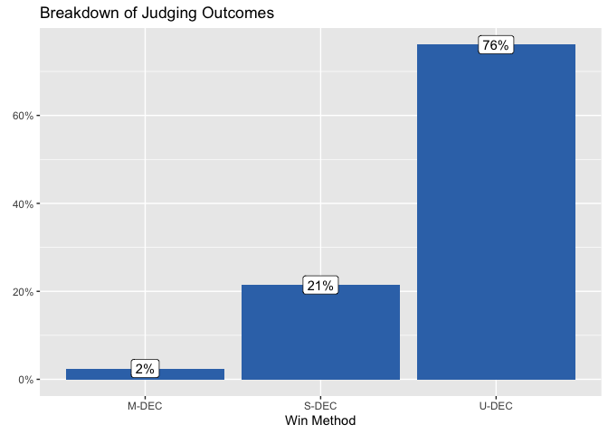

Is UFC Judging Fair?
================

When a UFC match ends with a knock-out or submission there is usually
never any doubt who the better fighter was. But only 54% of fights end
so decisively. The other 45% of fights go to the judges score cards.

<!-- -->

At least when the fights do go to the judges scorecard, it appears that
the judges are usually pretty confident. The judges are unanimous in
their decision 76% of the time.

<!-- -->

But, judging is tricky business. It is frequently the subject of public
scrutiny:

  - [The Bleacher Report’s 10 Most Controversial Judging Decisions in
    UFC History
    (2014)](https://bleacherreport.com/articles/2072171-the-10-most-controversial-judging-decisions-in-ufc-history#slide0)
  - [UFC commentator Joe Rogan on the issues with
    judging](https://www.youtube.com/watch?v=U8ZO5k5Gykk)

How can we assess if the judging if fair? Are the judges really
selecting the better fighter? Are they correctly applying the UFC rules
to select the winner?

### Assessing fairness

To answer this question we must first understand what the rules are. How
are the judges supposed to pick a winner? Then tools from statistics can
be used to see what the judges actually are looking at.

#### What are the rules?

The system is somewhat confusing, but here are the basics. Judges score
each round on a “*10-Point Must System*”:

  - The fighter deemed to have won the round receives 10 points.
  - The fighter deemed to have lost the round receives 9 points or
    fewer.
  - The fighter with the most points at the end of the fight wins.

The [official MMA
rules](http://www.abcboxing.com/wp-content/uploads/2016/08/juding_criteriascoring_rev0816.pdf)
describe scoring as follows:

>   - “*A 10 –10 round in MMA is when both fighters have competed for
>     whatever duration of time in the round and there is no difference
>     or advantage between either fighter.*”
>   - “*A 10 –9 Round in MMA is when one combatant wins the round by a
>     close margin.*”
>   - "“*A 10 –8 Round in MMA is when one fighter wins the round by a
>     large margin.*”

The official rules also provide additional guidance on what constitutes
winning. Some examples include:

>   - “*Effective Striking/Grappling shall be considered the first
>     priority of round assessments. Effective Aggressiveness is a ‘Plan
>     B’ and should not be considered unless the judge does not see ANY
>     advantage in the Effective Striking/Grappling realm. Cage/Ring
>     Control (‘Plan C’) should only be needed when ALL other criteria
>     are 100% even for both competitors. This will be an extremely rare
>     occurrence.*”
>   - “*Legal blows that have immediate or cumulative impact with the
>     potential to contribute towards the end of the match with the
>     IMMEDIATE weighing in more heavily than the cumulative impact.*”

#### What are the judges scoring?

We can never know what was really going on in a judges head. But by
using the data from every UFC fight, we can identify which features are
strongly correlated with winning or losing.

Logistic regression will be used to model the data. Logistic regression
will assign a weight to each feature, with larger weights signalling
greater importance. My hypothesis is that if the judging is fair, the
weights assigned by logistic regression should be aligned with what the
judges are supposed to score.

For example, based on my reading of the rules *effective striking*
should be very important criteria for a judge in selecting the winner.
Although there is no perfect way to report effective striking as a
single number, the number of strikes thrown is probably a close proxy.

The data collected has several features including:

  - `str` - The number of strikes landed
  - `td` - The number of take-downs
  - `sub` - The number of submissions
  - `pass` - The number of passes

| fighter\_1\_name   | fighter\_2\_name | fighter\_1\_str | fighter\_2\_str | fighter\_1\_td | fighter\_2\_td | fighter\_1\_sub | fighter\_2\_sub | fighter\_1\_pass | fighter\_2\_pass | winner     |
| :----------------- | :--------------- | --------------: | --------------: | -------------: | -------------: | --------------: | --------------: | ---------------: | ---------------: | :--------- |
| Charles Oliveira   | Kevin Lee        |              43 |              41 |              0 |              2 |               2 |               0 |                0 |                2 | fighter\_1 |
| Gilbert Burns      | Demian Maia      |              13 |               4 |              0 |              2 |               0 |               0 |                0 |                1 | fighter\_1 |
| Renato Moicano     | Damir Hadzovic   |               1 |               1 |              1 |              0 |               1 |               0 |                1 |                0 | fighter\_1 |
| Nikita Krylov      | Johnny Walker    |              45 |              37 |              3 |              0 |               0 |               0 |                4 |                2 | fighter\_1 |
| Francisco Trinaldo | John Makdessi    |              55 |              67 |              0 |              0 |               0 |               0 |                0 |                0 | fighter\_1 |
| Brandon Moreno     | Jussier Formiga  |              33 |              15 |              0 |              1 |               0 |               1 |                1 |                3 | fighter\_1 |

#### Assessing Fairness Visually

If the model is to work, we would expect to see that more strikes,
take-downs, submissions, and passes is correlated with winning. For each
feature, we can plot the relationship to visually compare.

<!-- -->

<!-- -->

<!-- -->

<!-- -->

For striking, take-downs, and passes it appears that at least visually
the better performing fighter usually wins. The relationship between
submissions and winning is not as clear.

#### Assessing Fairness with Logistic Regression

To better understand the relationship we can review the results of the
logistic regression model:

|    term     | estimate | std.error | statistic | p.value | significant |
| :---------: | -------: | --------: | --------: | ------: | :---------- |
| (Intercept) |     0.08 |      0.07 |       1.1 |    0.28 | FALSE       |
|  blue\_str  |     2.29 |      0.13 |      18.2 |    0.00 | TRUE        |
|  red\_str   |   \-2.33 |      0.13 |    \-18.2 |    0.00 | TRUE        |
|  blue\_td   |     0.44 |      0.09 |       4.9 |    0.00 | TRUE        |
|   red\_td   |   \-0.49 |      0.09 |     \-5.3 |    0.00 | TRUE        |
|  blue\_sub  |     0.13 |      0.07 |       1.7 |    0.09 | FALSE       |
|  red\_sub   |     0.08 |      0.07 |       1.1 |    0.27 | FALSE       |
| blue\_pass  |     0.75 |      0.11 |       6.8 |    0.00 | TRUE        |
|  red\_pass  |   \-0.53 |      0.10 |     \-5.1 |    0.00 | TRUE        |

The table above can help us finally answer the question “is UFC judging
fair?”. The results of the logistic regression reveal that:

  - As you might expect, the most important feature is striking. The
    more strikes you can land, the more likely you are to win over your
    opponent. Conversely, the more you get hit, the more likely you are
    to lose.
  - The next most important feature associated with winning are passes,
    and then take-downs.
  - The next most important features associated with losing are also
    passes, then take-downs.
  - Submissions were identified as not being statistically significant
    with at significance level of 0.05.

We can think of the results of the logistic regression as a proxy for
what judges actually care about. Further we can test the model to see
how will it generalizes to the actual data.

When I fit the model above I used a random sample of 80% of the fights.
We can test how well the model generalizes to the remaining 20% of the
data by generating predictions. A high prediction accuracy would suggest
fair judging. Or at least judging that is applied consistently.

On the training data, the model accurately predicts the correct winner
84.43% of the time. On the test data the model accurately predicts the
correct winner 81.53% of the time.

## Conclusion

So is the UFC fair? The analysis above is an attempt to answer the
question, but I think the results are far from conclusive.

  - Does rewarding striking, passes, and take-downs in that order align
    with judging rules?
  - Is 81.53% accuracy good enough?
  - Are there other confounding variables that judges are considering
    that are not present in the model (fighter size, reputation, past
    record, audience reaction, etc.)?

Personally, I think this analysis provides some comfort that the judging
is not terrible. If you land more strikes, you will probably win. If you
earn more take-downs, and do a better job of passing guard you will
probably win.

But I do not know if 81.53% is good enough. How do judges explain the
biggest outliers?

For example here are the 5 fights that the model was most confident
about, but predicted the wrong result.

| event\_name\_fighters                                                                | blue            | red                | colour\_win | blue\_str | red\_str | blue\_td | red\_td | blue\_sub | red\_sub | blue\_pass | red\_pass | blue\_win | prediction | prediction\_proba | correct |
| :----------------------------------------------------------------------------------- | :-------------- | :----------------- | :---------- | --------: | -------: | -------: | ------: | --------: | -------: | ---------: | --------: | :-------- | :--------- | ----------------: | :------ |
| UFC 96 - Jackson vs Jardine: Rampage Jackson vs. Keith Jardine                       | Rampage Jackson | Keith Jardine      | blue        |        56 |       64 |        2 |       0 |         0 |        0 |          1 |         0 | 1         | red        |              1.00 | FALSE   |
| UFC Fight Night - Nogueira vs Davis: John Hathaway vs. Kris McCray                   | John Hathaway   | Kris McCray        | blue        |        43 |       48 |        3 |       3 |         4 |        0 |          3 |         4 | 1         | red        |              0.99 | FALSE   |
| UFC Fight Night 1: Chris Leben vs. Patrick Cote                                      | Chris Leben     | Patrick Cote       | blue        |        26 |       26 |        1 |       1 |         0 |        0 |          1 |         1 | 1         | red        |              0.99 | FALSE   |
| UFC Fight Night - Overeem vs Arlovski: Josh Emmett vs. Jon Tuck                      | Josh Emmett     | Jon Tuck           | blue        |        54 |       53 |        0 |       0 |         0 |        0 |          0 |         0 | 1         | red        |              0.99 | FALSE   |
| UFC Fight Night - Moicano vs The Korean Zombie: Kevin Holland vs. Alessio Di Chirico | Kevin Holland   | Alessio Di Chirico | blue        |        58 |       51 |        0 |       2 |         0 |        0 |          0 |         0 | 1         | red        |              0.99 | FALSE   |

What happened in these fights that the fighter was able to win, while
performing poorly on striking, take-downs, and passes? Is it poor
judging, or something that can’t be observed in the data we have?

-----

### Notes

  - You can find the complete code behind the analysis here:
    <https://github.com/SamEdwardes/ufc-fairness/blob/master/blog/is_the_ufc_fair.Rmd>.
  - The logistic regression model is useless for picking fights before
    they occur, because it is using data that can only be observed after
    the fight occurred. So it cannot help any gamblers out there looking
    for an edge.
  - The data used can be found here:
    <https://github.com/SamEdwardes/ufc-data>.
  - At the time this post was created, the analysis was based on all
    fights from 1993-11-12 to 2020-03-14.
