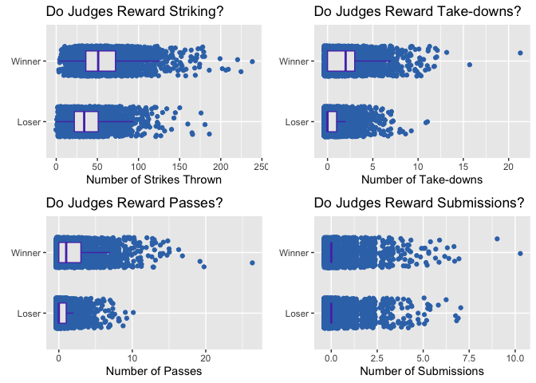

Is UFC Judging Fair?
================

The Ultimate Fighting Championship (UFC) is the world’s premier mixed
martial arts (MMA) promotion. The world’s best fighters compete to call
themsevles UFC champions.

The sport is relatively new, and the rules are still evolving. One
common area of controversy is the quality of judging in the UFC. There
are three main ways a figher can win:

  - **Submission** - Occurs when one opponent verbally submits or taps
    (e.g. rear naked choke).
  - **Technical knockout (TKO)** - Occurs when the referee stops the
    fight because they have determined one fighter can no longer defend
    himself (e.g. punch to the face).
  - **Judges score card** - Occurs when the fight lasts for all
    scheduled rounds. A panel of three judges scores the fight using a
    10 point system. The fighter with more points is deemed the winner.

*Note there are several other possible ways to win including “technical
decision”, “disqualification”, and “forfeit”. However these situations
are rarely occur.*

A slim majority of fights end with a technical knock out (TKO), or a
submission (53.68%). But many fights (45.03%) also go to the judges
score cards.

<!-- -->

Given that 54% of fights are determined by the judges, there is no doubt
judging is a very important aspect of the sport. A fighter often finds
their

The results of fights that do go the distance can be controversial. UFC
personalities and fighters often take to the web after fights to
complain about poor judging decisions:

  - [The Bleacher Report’s 10 Most Controversial Judging Decisions in
    UFC History
    (2014)](https://bleacherreport.com/articles/2072171-the-10-most-controversial-judging-decisions-in-ufc-history#slide0)
  - [UFC commentator Joe Rogan on the issues with
    judging](https://www.youtube.com/watch?v=U8ZO5k5Gykk)

### How does judging work?

The system is somewhat confusing, but here are the basics:

  - Judges score each round on a “*10-Point Must System*”.

  - The fighter deemed to have won the round receives 10 points.

  - The fighter deemed to have lost the round receives 9 points or
    fewer.

  - The figher with the most points at the end of the fight wins.

  - The [official MMA
    rules](http://www.abcboxing.com/wp-content/uploads/2016/08/juding_criteriascoring_rev0816.pdf)
    describe scoring as follows:
    
    >   - “*A 10 –10 round in MMA is when both fighters have competed
    >     for whatever duration of time in the round and there is no
    >     difference or advantage between either fighter.*”
    >   - “*A 10 –9 Round in MMA is when one combatant wins the round by
    >     a close margin.*”
    >   - "“*A 10 –8 Round in MMA is when one fighter wins the round by
    >     a large margin.*”

  - The official rules also provide additional guidance on what
    constitutes winning. Some examples include:
    
    >   - “*Effective Striking/Grappling shall be considered the first
    >     priority of round assessments. Effective Aggressiveness is a
    >     ‘Plan B’ and should not be considered unless the judge does
    >     not see ANY advantage in the Effective Striking/Grappling
    >     realm. Cage/Ring Control (‘Plan C’) should only be needed when
    >     ALL other criteria are 100% even for both competitors. This
    >     will be an extremely rare occurrence.*”
    >   - “*Legal blows that have immediate or cumulative impact with
    >     the potential to contribute towards the end of the match with
    >     the IMMEDIATE weighing in more heavily than the cumulative
    >     impact.*”

Based on a reading of the rules and general consensus from MMA
personalities, it is clear that judging is very subjective. This
analysis seeks to understand whether the judging is fair.

### How to assess if judging is fair?

Fairness is very subjective, so their is no “*right*” way to assess
fairness. But by using the rules and some statistical techniques we can
get a better idea if the judges are applying the rules consistently (and
therefore fairly).

For each fight, the UFC records some statistics:

  - **Striking**: The number of strikes landed by a fighter
  - **Takedowns**: The number of successful takedowns scored by a
    fighter
  - **Submission**: The number of submissions attempted by a fighter
  - **Pass**: The number of successful passes by a fighter

If the judges are being fair, they should consistetly award the same
behaviour. For example, if a fighter throws *x*% more strikes than their
opponent, than most of the time they should win.

Using the data, we can explore how each of these indicators is related
with winning:

    ## [1] 33
    ## [1] 29

<!-- -->

    ## [1] 1.1
    ## [1] 1.7

<!-- -->

    ## [1] 1.1
    ## [1] 2

<!-- -->

    ## [1] 0.42
    ## [1] 0.87

<!-- -->
